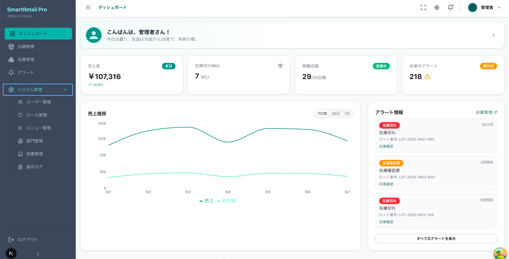

# SmartRetail Pro - Frontend

Next.js 15 App Router ベースの小売DXフロントエンド

## プロジェクト概要

### 目的

小売店舗向けDXソリューション「SmartRetail Pro」のフロントエンドアプリケーション。
店舗運営の効率化とデータドリブンな意思決定を支援する管理画面を提供。

### 対象ユーザー

- 店舗管理者
- 本部スタッフ
- システム管理者

### 主要機能

| 機能           | 説明                                         |
| -------------- | -------------------------------------------- |
| ダッシュボード | KPI表示、売上トレンド、在庫状況の可視化      |
| 商品管理       | 商品マスタのCRUD、カテゴリ管理               |
| 店舗管理       | 店舗情報の登録・編集                         |
| 端末管理       | POS端末、IoTデバイスの管理                   |
| 在庫管理       | 在庫照会、補充・廃棄処理                     |
| 取引履歴       | 売上明細の検索・閲覧                         |
| アラート       | リアルタイム通知（WebSocket）                |
| システム管理   | ユーザー、ロール、メニュー、部門、辞書、ログ |

### システム構成

```
┌─────────────────┐     ┌─────────────────┐     ┌─────────────────┐
│   Browser       │────▶│  Next.js Server │────▶│  Spring Boot    │
│   (React 19)    │     │  (BFF)          │     │  Backend API    │
└─────────────────┘     └─────────────────┘     └─────────────────┘
                              │                        │
                              │                        ▼
                              │                 ┌─────────────────┐
                              └────────────────▶│  WebSocket      │
                                                │  (STOMP)        │
                                                └─────────────────┘
```

### イメージ図



### Vue版との関係

本プロジェクトは、既存Vue3版フロントエンドのNext.js移行版として開発。

| 項目           | Vue3版 (既存)                   | Next.js版 (本リポ)       |
| -------------- | ------------------------------- | ------------------------ |
| リポジトリ     | `smart-retail-dx/apps/frontend` | `tech-lead-react-demo`   |
| フレームワーク | Vue 3 + Vite                    | Next.js 15 (App Router)  |
| UIライブラリ   | Element Plus                    | shadcn/ui + Radix UI     |
| 状態管理       | Pinia                           | TanStack Query + Zustand |
| スタイル       | SCSS                            | Tailwind CSS v4          |
| レンダリング   | CSR (SPA)                       | SSR + RSC (ハイブリッド) |
| 認証           | localStorage                    | httpOnly Cookie          |
| テスト         | Playwright                      | Playwright + Mock Server |

**移行の目的:**

- React Server Components によるパフォーマンス向上
- httpOnly Cookie による認証セキュリティ強化
- TypeScript型安全性の向上
- テックリード設計スキルのデモンストレーション

**共通点:**

- 同一のSpring Boot Backend APIに接続
- 同一の機能要件・画面構成
- 並行運用可能（別ポートで稼働）

---

## Tech Lead 設計ポイント一覧

### アーキテクチャ設計

| カテゴリ          | 設計ポイント                             | 状態 | 備考                     | clear |
| ----------------- | ---------------------------------------- | :--: | ------------------------ | ----- |
| フレームワーク    | Next.js App Router 採用                  |  ✅  | RSC, Streaming対応       |       |
| ディレクトリ構成  | Feature-based (Vertical Slice)           |  ✅  | `features/` で凝集度向上 |       |
| ルーティング      | Route Groups による認証分離              |  ✅  | `(auth)` / `(dashboard)` |       |
| レイアウト        | Nested Layouts                           |  ✅  | 共通UI効率化             |       |
| Server/Client境界 | 明確な責務分離                           |  ✅  | ADR-003 で定義           |       |
| 状態管理          | Server: TanStack Query / Client: Zustand |  ✅  | 用途別に最適化           |       |
| ADR               | アーキテクチャ決定記録                   |  ✅  | 11件作成済み             |       |

### 認証

| カテゴリ       | 設計ポイント                       | 状態 | 備考                    | clear |
| -------------- | ---------------------------------- | :--: | ----------------------- | ----- |
| JWT認証        | httpOnly Cookie + 自動リフレッシュ |  ✅  | XSS対策                 |       |
| WebSocket認証  | 短TTLチケット方式                  |  ✅  | 短TTL・メモリ利用に限定 |       |
| API Proxy      | Route Handler経由                  |  ✅  | CORS回避、トークン隠蔽  |       |
| セッション管理 | Server-side Cookie検証             |  ✅  | Middleware で実装       |       |
| 認可           | ロールベースアクセ���制御          |  ✅  | Backend連携             |       |

### セキュリティ

| カテゴリ             | 設計ポイント            | 状態 | 備考                                          | clear |
| -------------------- | ----------------------- | :--: | --------------------------------------------- | ----- |
| XSS対策              | httpOnly Cookie         |  ✅  | トークン窃取防止                              |       |
| CSRF対策             | Double Submit Cookie    |  ✅  | `x-csrf-token` ヘッダ検証                     |       |
| 入力バリデーション   | Zod スキーマ            |  ✅  | クライアント/サーバー共通                     |       |
| 出力エスケープ       | React自動エスケープ     |  ✅  | JSX標準機能                                   |       |
| CSP設定              | Content Security Policy |  ✅  | `next.config.ts` で設定                       |       |
| セキュリティヘッダー | X-Frame-Options等       |  ✅  | HSTS, Referrer-Policy, Permissions-Policy含む |       |
| 依存関係脆弱性       | npm audit / Snyk        |  ✅  | `pnpm audit` / Dependabot 導入                |       |
| 機密情報管理         | 環境変数分離            |  ✅  | `.env.local`                                  |       |
| HTTPS強制            | 本番環境設定            |  ✅  | Next.js設定                                   |       |

### コード品質

| カテゴリ         | 設計ポイント                 | 状態 | 備考                             | clear |
| ---------------- | ---------------------------- | :--: | -------------------------------- | ----- |
| 型安全性         | TypeScript strict mode       |  ✅  | `strict: true`                   |       |
| Linter           | ESLint (Next.js recommended) |  ✅  | `npm run lint`                   |       |
| Formatter        | Prettier                     |  ✅  | `.prettierrc` / フォーマット済み |       |
| pre-commit hooks | husky + lint-staged          |  ✅  | pre-commit で自動実行            |       |
| commit規約       | Conventional Commits         |  ✅  | commitlint 導入                  |       |

### テスト戦略

| カテゴリ             | 設計ポイント           | 状態 | 備考                       | clear |
| -------------------- | ---------------------- | :--: | -------------------------- | ----- |
| E2Eテスト            | Playwright             |  ✅  | 4 spec                     |       |
| APIモック            | Standalone Mock Server |  ✅  | `e2e/mocks/mock-server.ts` |       |
| テストポリシー       | E2Eテスト方針文書      |  ✅  | `_docs/e2e-test-policy.md` |       |
| ユニットテスト       | Vitest                 |  ❌  | E2E のみ方針のため未導入   |       |
| コンポーネントテスト | Testing Library        |  ❌  | E2E のみ方針のため未導入   |       |
| カバレッジ計測       | coverage threshold     |  ✅  | Playwright coverage 導入   |       |
| VRT                  | Visual Regression Test |  ✅  | `toHaveScreenshot` 導入    |       |

### CI/CD・DevOps

| カテゴリ       | 設計ポイント                    | 状態 | 備考                             | clear |
| -------------- | ------------------------------- | :--: | -------------------------------- | ----- |
| CI Pipeline    | GitHub Actions                  |  ✅  | `.github/workflows/ci.yml`       |       |
| PR自動チェック | lint / typecheck / test / build |  ✅  | `.github/workflows/pr-check.yml` |       |
| 依存関係更新   | Renovate / Dependabot           |  ✅  | `.github/dependabot.yml`         |       |
| Bundle分析     | @next/bundle-analyzer           |  ✅  | `pnpm analyze`                   |       |

### UX・パフォーマンス

| カテゴリ           | 設計ポイント                 | 状態 | 備考                      | clear |
| ------------------ | ---------------------------- | :--: | ------------------------- | ----- |
| ローディングUI     | `loading.tsx` + Suspense     |  ✅  | 標準化                    |       |
| エラーハンドリング | `error.tsx` + Error Boundary |  ✅  | 階層別エラー              |       |
| 国際化             | next-intl (ja/en)            |  ✅  | locale routing            |       |
| ダークモード       | next-themes                  |  ✅  | システム連動              |       |
| Web Vitals計測     | Core Web Vitals              |  ✅  | `useReportWebVitals` 導入 |       |
| エラー監視         | Sentry等                     |  ✅  | `@sentry/nextjs` 導入     |       |

### ドキュメント

| カテゴリ         | 設計ポイント                  | 状態 | 備考                             | clear |
| ---------------- | ----------------------------- | :--: | -------------------------------- | ----- |
| README           | プロジェクト概要              |  ✅  | 本ファイル                       |       |
| CLAUDE.md        | AI開発ルール                  |  ✅  | 関連リソース参照                 |       |
| ADR              | Architecture Decision Records |  ✅  | `_docs/adr/` (8件)               |       |
| アーキテクチャ図 | システム構成図                |  ✅  | `_docs/architecture.drawio`      |       |
| CONTRIBUTING.md  | 開発者ガイド                  |  ✅  | `CONTRIBUTING.md` 作成           |       |
| Storybook        | コンポーネントカタログ        |  ✅  | Storybook 8 + サンプルストーリー |       |
| API仕様連携      | OpenAPI自動型生成             |  ✅  | `openapi-typescript` 導入        |       |

### 完了サマリー

| ステータス | 件数    |
| ---------- | ------- |
| ✅ 完了    | 48      |
| ❌ 未完了  | 2       |
| **完了率** | **96%** |

| カテゴリ           | 完了 | 未完了 |
| ------------------ | :--: | :----: |
| アーキテクチャ設計 |  7   |   0    |
| 認証               |  5   |   0    |
| セキュリティ       |  9   |   0    |
| コード品質         |  5   |   0    |
| テスト戦略         |  5   |   2    |
| CI/CD・DevOps      |  4   |   0    |
| UX・パフォーマンス |  6   |   0    |
| ドキュメント       |  7   |   0    |

---

## 技術スタック

| カテゴリ      | 技術                                   |
| ------------- | -------------------------------------- |
| Framework     | Next.js 15 (App Router, React 19)      |
| UI            | shadcn/ui + Radix UI + Tailwind CSS v4 |
| Server State  | TanStack Query v5                      |
| Client State  | Zustand v5                             |
| Form          | React Hook Form + Zod                  |
| i18n          | next-intl (ja/en)                      |
| Realtime      | @stomp/stompjs                         |
| E2E Test      | Playwright + Standalone Mock Server    |
| Monitoring    | Sentry + /api/health                   |
| Accessibility | @axe-core/playwright                   |

## セットアップ

```bash
npm install
cp .env.example .env.local
```

## 開発コマンド

```bash
npm run dev              # 開発サーバー (port 3001)
npm run build            # ビルド
npm run lint             # ESLint
npm run typecheck        # TypeScript 型チェック
npm run format:check     # Prettier フォーマット確認
npm run test:e2e         # E2Eテスト
npm run test:e2e:coverage # E2Eテスト＋カバレッジ
npm run analyze          # Bundle 分析
npm run storybook        # Storybook 起動
npm run generate:api-types # OpenAPI 型生成
```

## ディレクトリ構成

```
app/
├── [locale]/           # 国際化ルート
│   ├── (auth)/         # 認証不要
│   └── (dashboard)/    # 認証必須
└── api/                # Route Handlers

features/               # 機能モジュール (Vertical Slice)
├── auth/               # 認証
├── products/           # 商品管理
├── stores/             # 店舗管理
├── devices/            # 端末管理
├── transactions/       # 取引履歴
├── inventory/          # 在庫管理
├── alerts/             # アラート (WebSocket)
└── system/             # システム管理

components/
├── ui/                 # shadcn/ui
├── layout/             # Sidebar, Header
└── providers/          # Context Providers

lib/
├── api/
│   ├── client.ts       # Client Component用
│   └── server.ts       # Server Component用
└── utils.ts
```

## ADR一覧

| ADR | タイトル                             |
| --- | ------------------------------------ |
| 001 | App Router採用とディレクトリ方針     |
| 002 | JWT認証 (ハイブリッドアプローチ)     |
| 003 | Server/Client境界                    |
| 004 | UIライブラリ (shadcn/ui)             |
| 005 | STOMPリアルタイム                    |
| 006 | Appフォルダ構成                      |
| 007 | 状態管理 (Zustand)                   |
| 008 | E2Eテスト (Playwright + Mock Server) |
| 009 | i18nルーティング設計                 |
| 010 | 認証付きfetchキャッシュ方針          |

## 関連ドキュメント

- [Tech Lead ロードマップ](./_docs/tech-lead-roadmap.md) - 学習順序と進捗管理
- [E2Eテストポリシー](./_docs/e2e-test-policy.md)
- [設計レビュー対応記録](./_review/review_0710_adr-architecture.claude.md)
- [アーキテクチャ図](./_docs/architecture.drawio)
- Tech Lead ノート: `blog/src/notes/11.react/3.tech-lead/` - 設計解説（初心〜中級者向け）

---

## 変更履歴

| 日付       | 変更内容                                                                                                                                                                                                                                                  |
| ---------- | --------------------------------------------------------------------------------------------------------------------------------------------------------------------------------------------------------------------------------------------------------- |
| 2026-07-10 | 設計レビュー指摘対応: ADRステータス更新、i18n/cache ADR追加、SSR refresh、認証付きfetch no-store、モック認証本番無効化、テストID依存反転、Standalone Mock Server方針更新                                                                                  |
| 2026-06-20 | Tech Lead 追加改善: 環境変数検証、`/api/health`、API クライアント強化（timeout/retry/locale リダイレクト）、CSP report-to + CSRF トークン + レート制限、アクセシビリティテスト、data-testid ベース E2E セレクタ移行、VRT 安定化、Storybook ストーリー追加 |
| 2026-06-16 | CSP設定・セキュリティヘッダー実装（`next.config.ts`）、E2Eテスト追加                                                                                                                                                                                      |
| 2026-06-13 | Tech Leadノート（設計解説記事）をblogリポジトリに移管、関連ドキュメントセクション更新                                                                                                                                                                     |
| 2026-06-01 | 再レビュー指摘対応（ESLint lint error修正、全ページisRedirectError対応、mockサーバーMOCK_PORT対応、refresh-tokenエンドポイント追加、stores/devices detail API追加）                                                                                       |
| 2026-06-01 | レビュー指摘対応（編集画面API修正、認証エラー処理、リフレッシュトークン実装、i18nルーティング統一、ESLint設定追加、E2Eポート設定改善）                                                                                                                    |
| 2025-05-31 | セキュリティカテゴリを独立追加、完了サマリー更新                                                                                                                                                                                                          |
| 2025-05-31 | Vue版との関係セクション追加                                                                                                                                                                                                                               |
| 2025-05-31 | プロジェクト概要セクション追加                                                                                                                                                                                                                            |
| 2025-05-31 | Tech Lead設計ポイント一覧追加（7カテゴリ）                                                                                                                                                                                                                |
| 2025-05-31 | README.md / CLAUDE.md 初版作成                                                                                                                                                                                                                            |
