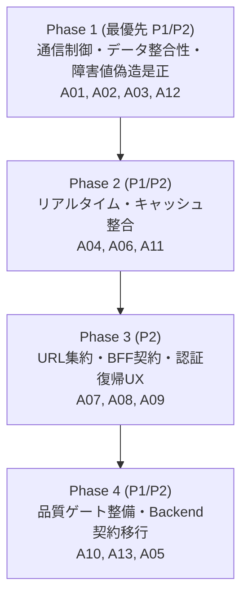

# frontend-architecture レビュー指摘対応 実装計画 (A01〜A13)

- 作成日: 2026-09-15
- 元レビュー: `review_0914_frontend-architecture.codex.md` (09/14 A01〜A10, 09/15追記 A11〜A13)
- 対象: `apps/frontend-next` (ブランチ: `feature/front-next-base`)
- 修正テーマ: `frontend-architecture-fix`（通信制御・キャッシュ整合・障害値偽造是正・リアルタイム購読・BFF契約）

---

## 1. 全体方針とフェーズ構成

Feature-based Vertical Slice、Next.js App Router、BFF、TanStack Query、Zustand の基本アーキテクチャを維持しつつ、分割した層の接続部分（セッション境界、通信再送・中断制御、キャッシュ無効化、SSR hydration、BFF契約）の整合性を4段階で是正します。



### 指摘一覧と対応フェーズ対応表

| ID | 優先度 | 指摘の要約 | フェーズ | 対象ファイル |
| :--- | :--- | :--- | :--- | :--- |
| **A01** | P1 / High | セッション切替で Query / アラートキャッシュが残る | **Phase 1** | `components/providers/query-provider.tsx`, `components/layout/header.tsx` |
| **A02** | P1 / High | 非冪等な更新（POST等）も通信失敗時に自動再送される | **Phase 1** | `lib/api/client.ts` |
| **A03** | P1 / High | ダッシュボードが障害・欠損を正常値（稼働率99.98%等）に変換する | **Phase 1** | `features/dashboard/lib/dashboard-api.server.ts`, `kpi-cards.tsx` |
| **A12** | P2 / Med | タイムアウトと中断をレスポンス本文（json読取）まで維持する | **Phase 1** | `lib/api/client.ts`, 各 feature API client / hook |
| **A04** | P1 / High | STOMP 再接続で購読が失われ、停止後も再接続タイマーが残る | **Phase 2** | `features/alerts/hooks/use-stomp.ts` |
| **A06** | P2 / Medium | アラートの複数データソース統合で削除済み行が復活する | **Phase 2** | `features/alerts/components/alert-list-client.tsx`, `use-alert-subscription.ts` |
| **A11** | P2 / Medium | 更新の影響範囲とキャッシュ無効化を揃える (all / history) | **Phase 2** | `features/products/hooks/use-products.ts`, `features/inventory/hooks/use-inventory.ts` |
| **A07** | P2 / Medium | 検索条件（category等）がURL・SSR・Queryで一致しない | **Phase 3** | `app/[locale]/(dashboard)/products/page.tsx`, `product-table-client.tsx` |
| **A08** | P2 / Medium | BFF Proxy が JSON 専用で CSV を壊し、エラー契約も一致しない | **Phase 3** | `app/api/proxy/[...path]/route.ts` |
| **A09** | P2 / Medium | 認証回復・リダイレクトの責務が分散（/api/proxy へ戻る問題） | **Phase 3** | `middleware.ts`, `lib/api/client.ts`, `login-form.tsx` |
| **A10** | P2 / Medium | 標準 lint が features を検査せず、警告が未解消 | **Phase 4** | `package.json`, `eslint.config.mjs` |
| **A13** | P1 / High | refresh token が URL クエリに含まれている（Backend 協調） | **Phase 4** | `app/api/auth/refresh/route.ts`, `middleware.ts` |
| **A05** | P1 / High | WebSocket 認証で生の access token を返す（Backend 協調・ADR） | **Phase 4** | `docs/architecture/adr-005-websocket-architecture.md` |

---

## 2. 開発運用ルール（`AGENTS.md` 厳守要件）

1. **`noUncheckedIndexedAccess: true` の遵守と `as any` の禁止**:
   - 配列や辞書アクセス時は必ず `undefined` の可能性を考慮し、フォールバック（`??`）やガードを設置すること。
2. **UIマッピングの防御的プログラミング**:
   - ステータスや Enum の変換テーブルには必ず `?? DEFAULT_CONFIG` を設けること。
3. **アクセス禁止ディレクトリ**:
   - `apps/backend-go`: 修正・参照ともに厳禁
   - `apps/frontend`: 既存 Vue 版（修正NG、参照のみ可）
4. **品質ゲート確認コマンド**:
   - 各フェーズ完了時に `cd apps/frontend-next && pnpm typecheck && pnpm lint` を必ずパスすること。

---

## 3. 各フェーズの詳細実装内容

### Phase 1: 通信制御・データ整合性・障害値偽造是正 (A01, A02, A03, A12)

#### 1. `lib/api/client.ts` の是正 (A02, A12, A09一部)
- **非冪等再送の抑止**: 自動再送の対象を `GET`, `HEAD` のみに制限。`POST`, `PUT`, `DELETE`, `PATCH` は自動再送しない。
- **ユーザー中断の再送抑止**: `AbortError` が発生した場合は再試行ループを即中断する。
- **本文読取までのタイムアウト維持**:
  ```ts
  // 修正前: await fetch の直後に cleanup() を呼んでいたため、response.json() 受信中のハングに対応できない
  // 修正後: try ... finally で囲み、本文の読取完了までタイマーを有効に維持する
  const { signal, cleanup } = createAbortSignal(timeoutMs, options?.signal);
  try {
    const response = await fetch(path, { ...options, signal });
    // ... 認証・ステータス判定 ...
    return await response.json();
  } finally {
    cleanup();
  }
  ```
- **ログイン画面リダイレクトURLの是正**: `redirectToLogin(path)` で API URL（`/api/proxy/...`）が渡されていたのを、現在ブラウザが表示している安全なパス（`window.location.pathname + window.location.search`）に修正。

#### 2. `features/dashboard/lib/dashboard-api.server.ts` & `kpi-cards.tsx` の是正 (A03)
- **障害値・欠損値の偽造撤廃**:
  - `getKpiData()` の catch 節で `sales: 0`, `systemUptime: 99.98`, `profit: sales * 0.25` 等の架空数値を返すのを廃止。
  - 取得失敗時は明示的に `null` または `isError: true` を返し、UI (`kpi-cards.tsx`) 側で「-」またはエラーバッジを表示する。
  - `getSalesTrend()` で Backend から提供されていない利益を「売上 * 0.25」と勝手に算出して返すロジックを削除。

#### 3. `components/providers/query-provider.tsx` & `header.tsx` の是正 (A01)
- **セッション終了時のキャッシュ完全クリア**:
  - ログアウト処理時に `queryClient.cancelQueries()`（進行中通信の中断）および `queryClient.clear()`（メモリキャッシュ破棄）を実行。
  - `useAlertStore.getState().reset()` でアラート状態も初期化。
  - WebSocket / STOMP の切断処理を実行。

---

### Phase 2: リアルタイム・キャッシュライフサイクル整合 (A04, A06, A11)

#### 1. `features/alerts/hooks/use-stomp.ts` の是正 (A04)
- **購読意図の永続化**: `desiredSubscriptionsRef` を用意し、購読希望トピックとコールバックを接続世代を跨いで保持。
- **再接続時の自動再購読**: `client.onConnect` 内で `desiredSubscriptionsRef` に基づいて全トピックを再購読し、`activeSubscriptionsRef` を更新。
- **タイマーの確実な解除**: 再接続用 `setTimeout` の戻り値を `reconnectTimerRef` に保持し、`disconnect()` およびコンポーネント unmount 時に `clearTimeout` を実行。
- **世代管理**: `generationId` をインクリメントし、古い非同期接続処理が新しい世代を上書きしないようガード。

#### 2. `features/alerts/components/alert-list-client.tsx` の是正 (A06)
- **Query キャッシュへの一本化**:
  - `initialAlerts`（SSR）をローカルで常時三方マージ（initial + REST + realtime）するのを廃止。
  - SSR データは TanStack Query の `initialData` として初期キャッシュに流し込み、表示の Single Source of Truth を Query キャッシュにする。
  - アラート削除時は Query キャッシュから削除（または invalidate）。
  - WebSocket 受信時は該当 Query の `invalidateQueries` を基本とする。

#### 3. `use-products.ts` & `use-inventory.ts` の是正 (A11)
- **Mutation キャッシュ無効化の網羅**:
  - 商品作成・更新・削除時: `productKeys.lists()` だけでなく、選択肢用の `productKeys.all`（prefix）も無効化。
  - 在庫補充・廃棄時: `inventoryKeys.lists()` だけでなく、`inventoryKeys.history()` および `inventoryKeys.transactions()` も合わせて無効化。

---

### Phase 3: URL集約・BFF契約統一・認証復帰UX (A07, A08, A09)

#### 1. `products/page.tsx` & `product-table-client.tsx` の是正 (A07)
- **検索条件の URL 集約**:
  - `ProductQuery` 用の純粋な parser / serializer を作成し、Server Component と Client Component で共有（`categoryId` の欠損を解消）。
  - Client の `useState(initialParams)` でローカルに条件を孤立させるのをやめ、URL query params を正本として同期。
  - SSR データの `placeholderData` による重複取得を解消し、適切なキーと条件で hydration を行う。

#### 2. `app/api/proxy/[...path]/route.ts` の是正 (A08)
- **CSV/バイナリ透過転送**:
  - レスポンスの `Content-Type` を判定し、`application/json` 以外（`text/csv`, `application/octet-stream` など）は `json()` で読まずに `body` ストリームを透過転送し、`Content-Disposition` ヘッダーを保持。
- **エラー契約の統一**:
  - エラー応答時は一貫した `{ code, message }` 形式に正規化し、業務エラーメッセージが落ちないようにする。

#### 3. `middleware.ts` & 認証回復フローの是正 (A09)
- 401 発生時のリダイレクト先検証を行い、安全な画面パス（同一オリジン）に限定。
- ログイン画面への `returnUrl` に locale と現在の画面パスを正しく引き継ぐ。

---

### Phase 4: 品質ゲート整備 & Backend契約移行 (A10, A13, A05)

#### 1. `package.json` & `eslint.config.mjs` の是正 (A10)
- `package.json` の `lint` コマンドに対象ディレクトリ（`features` 等）を追加。
- `pnpm exec eslint features --no-cache` で検出される警告（32件）を解消。

#### 2. `auth/refresh/route.ts` & `middleware.ts` の是正 (A13)
- refresh token を URL クエリパラメータ（`?refreshToken=...`）で送信していた実装を、POST リクエスト本文（JSON: `{ "refreshToken": refreshToken }`）で送信する形式へ移行（Backend協調）。

#### 3. WebSocket 認証仕様 ADR の更新 (A05)
- WebSocket 接続時にブラウザへ生の access token を渡さない構成（短命チケット検証または Cookie handshake）への移行方針と契約要件を ADR-005 に追記。

---

## 4. Antigravity CLI (`agy`) 向け実行プロンプト集

ターミナルで `agy` を起動し、以下のプロンプトをフェーズごとに投入して実行してください。

### 🚀 Phase 1 投入プロンプト
```text
/Volumes/Dev/Git/learning/ai-prompt/project/smart-retail/review_0914_frontend-architecture.codex.md の指摘に基づき、Phase 1 (A01, A02, A03, A12) の改修を実施してください。

【対象と要件】
1. apps/frontend-next/lib/api/client.ts (A02, A12):
   - 自動再送を GET, HEAD のみに制限し、POST/PUT/DELETE/PATCH は自動再送しないこと。
   - AbortError（ユーザー中断）は再送しないこと。
   - cleanup() を fetch() 直後ではなく try ... finally で囲み、await response.json() 完了（またはエラー）までタイマー・中断シグナルを維持すること。
   - options.signal を受け取り、内部の createAbortSignal と適切に連動させること。
   - redirectToLogin(path) で API URL（/api/proxy/...）が渡されていたのを、現在表示中の安全な画面パス（window.location.pathname + window.location.search）にすること。

2. apps/frontend-next/features/dashboard/lib/dashboard-api.server.ts & features/dashboard/components/kpi-cards.tsx (A03):
   - getKpiData() の catch 節で売上0、稼働率99.98% などの偽造数値を返すのを廃止し、取得失敗時は明示的なエラー/null状態を保持すること。
   - kpi-cards.tsx で取得失敗した指標カードには「-」またはエラー表示を行うこと。
   - getSalesTrend() 等で Backend から提供されていない利益を「売上 * 0.25」と勝手な固定割合で生成するコードを排除すること。

3. apps/frontend-next/components/providers/query-provider.tsx & components/layout/header.tsx (A01):
   - ログアウト時に queryClient.cancelQueries() と queryClient.clear()、および useAlertStore.getState().reset() を確実に呼び出し、前セッションのキャッシュが別ユーザーに漏洩しないようにすること。

【制約・完了条件】
- noUncheckedIndexedAccess: true を遵守し、as any は使わないこと。
- cd apps/frontend-next && pnpm typecheck && pnpm lint がエラーなく通ること。
```

### 🚀 Phase 2 投入プロンプト
```text
/Volumes/Dev/Git/learning/ai-prompt/project/smart-retail/review_0914_frontend-architecture.codex.md の指摘に基づき、Phase 2 (A04, A06, A11) の改修を実施してください。

【対象と要件】
1. apps/frontend-next/features/alerts/hooks/use-stomp.ts (A04):
   - desiredSubscriptions（購読希望トピックとコールバック）を接続世代を跨いで永続保持する Ref を用意すること。
   - client.onConnect 内で desiredSubscriptions を元にすべての購読を再登録し、activeSubscriptionsRef を更新すること。
   - 再接続 setTimeout のタイマーIDを保持し、disconnect() および unmount 時に clearTimeout で確実に破棄すること。
   - 接続世代 ID (generationId) を導入し、古い非同期トークン取得や古い接続完了が新しい世代を上書きしないよう制御すること。

2. apps/frontend-next/features/alerts/components/alert-list-client.tsx & hooks/use-alert-subscription.ts (A06):
   - initialAlerts（SSRデータ）をローカルで常時三方マージ（initial + REST + realtime）するのを廃止すること。
   - SSR データは TanStack Query の initialData として初期キャッシュにのみ注入し、表示の Single Source of Truth を Query キャッシュに一本化すること。
   - アラート削除時は Query キャッシュから削除（または invalidate）し、SSR データから再復活しないようにすること。
   - WebSocket 受信時は、全一覧への無条件 push ではなく、該当クエリの invalidateQueries を基本とすること。

3. apps/frontend-next/features/products/hooks/use-products.ts & features/inventory/hooks/use-inventory.ts (A11):
   - 商品作成・更新・削除時、productKeys.lists() だけでなく productKeys.all（セレクト用 options を含む全体 prefix）を無効化すること。
   - 在庫補充・廃棄時、inventoryKeys.lists() だけでなく inventoryKeys.history() および inventoryKeys.transactions() も合わせて無効化すること。

【制約・完了条件】
- noUncheckedIndexedAccess: true を遵守し、as any は使わないこと。
- cd apps/frontend-next && pnpm typecheck && pnpm lint がエラーなく通ること。
```

### 🚀 Phase 3 投入プロンプト
```text
/Volumes/Dev/Git/learning/ai-prompt/project/smart-retail/review_0914_frontend-architecture.codex.md の指摘に基づき、Phase 3 (A07, A08, A09) の改修を実施してください。

【対象と要件】
1. apps/frontend-next/app/[locale]/(dashboard)/products/page.tsx & features/products/components/product-table-client.tsx (A07):
   - ProductQuery の URL クエリ parser / serializer を作成し、Server Component と Client Component で共有すること（categoryId パラメータの欠損を解消）。
   - ProductTableClient で useState(initialParams) に条件を閉じ込めるのをやめ、URL 検索パラメータを正本として連動させること（ブラウザの戻る/進むへの追従）。
   - useProducts で placeholderData による重複取得やキー不一致を解消し、適切なキーと条件で hydration を行うこと。

2. apps/frontend-next/app/api/proxy/[...path]/route.ts (A08):
   - レスポンスの Content-Type を判定し、application/json 以外（text/csv, application/octet-stream など）の場合は json() で読まずに body ストリームを透過転送し、Content-Disposition 等のヘッダーを維持すること（CSV ダウンロードが 500 になる問題を修正）。
   - エラー応答時は一貫した { code, message } 形式に正規化し、業務エラーメッセージが欠落しないようにすること。

3. apps/frontend-next/middleware.ts & 認証回復フロー (A09):
   - 401 発生時のリダイレクト先検証を行い、安全な画面パス（同一オリジン）に限定すること。
   - 再ログイン後に元の画面へ安全に復帰できるよう returnUrl / callbackUrl の受け渡しを整理すること。

【制約・完了条件】
- noUncheckedIndexedAccess: true を遵守し、as any は使わないこと。
- cd apps/frontend-next && pnpm typecheck && pnpm lint がエラーなく通ること。
```

### 🚀 Phase 4 投入プロンプト
```text
/Volumes/Dev/Git/learning/ai-prompt/project/smart-retail/review_0914_frontend-architecture.codex.md の指摘に基づき、Phase 4 (A10, A13, A05) の改修を実施してください。

【対象と要件】
1. apps/frontend-next/package.json & eslint.config.mjs (A10):
   - package.json の lint スクリプトを、features を含むように更新すること（例: next lint --dir app --dir features --dir components --dir lib --dir store --dir i18n）。
   - `pnpm exec eslint features --no-cache` で検出される警告（約32件）を精査・解消すること。

2. apps/frontend-next/app/api/auth/refresh/route.ts & middleware.ts (A13):
   - refresh token を URL クエリパラメータ（?refreshToken=...）で送信していた実装を、POST リクエスト本文（JSON: { "refreshToken": refreshToken }）で送信する形式へ移行すること。
   - ログ出力時に refresh token や Cookie が露出しないようサニタイズを徹底すること。

3. docs/architecture/adr-005-websocket-architecture.md (A05):
   - WebSocket 接続時にブラウザへ生の access token を渡さない構成（短命ワンタイムチケットのBroker直接検証、または Cookie handshake）への移行方針と契約要件を ADR に追記・更新すること。

【制約・完了条件】
- apps/frontend-next ディレクトリで `pnpm lint` を実行し、0 errors, 0 warnings となること。
- `pnpm typecheck` がエラーなく通ること。
```
