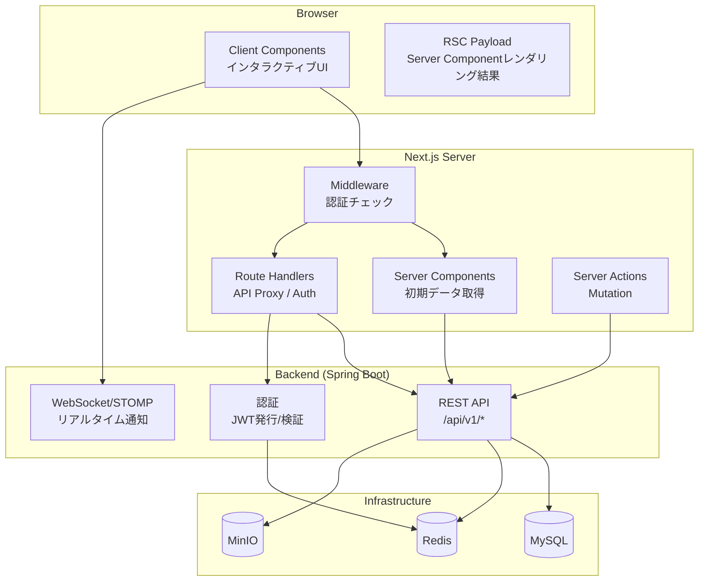
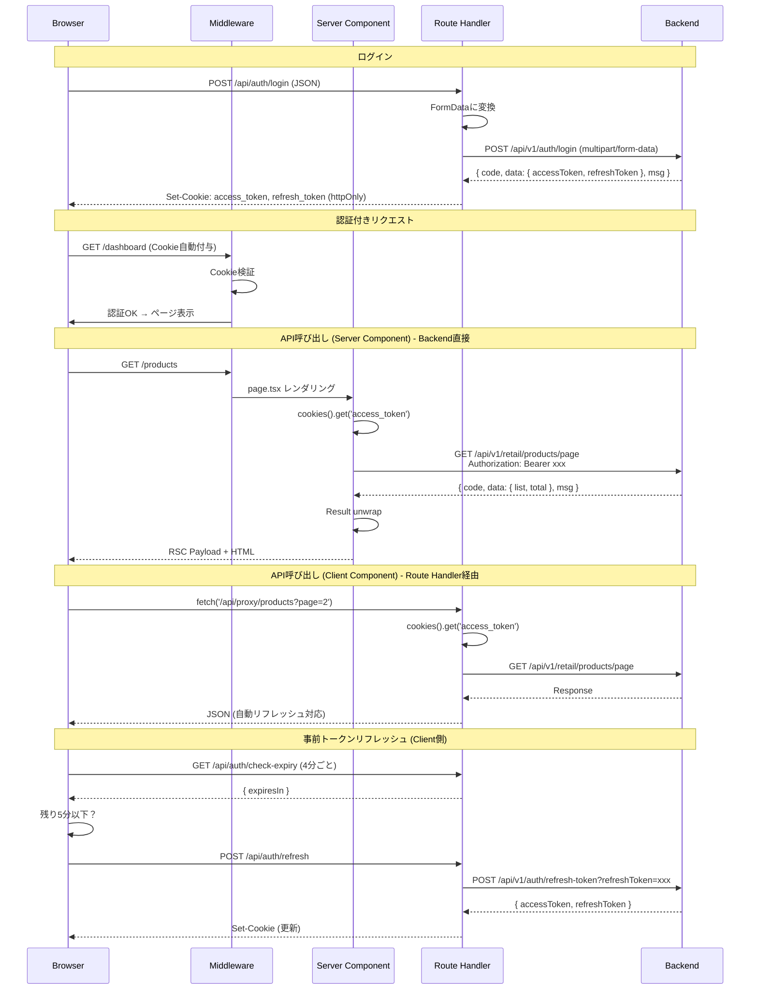
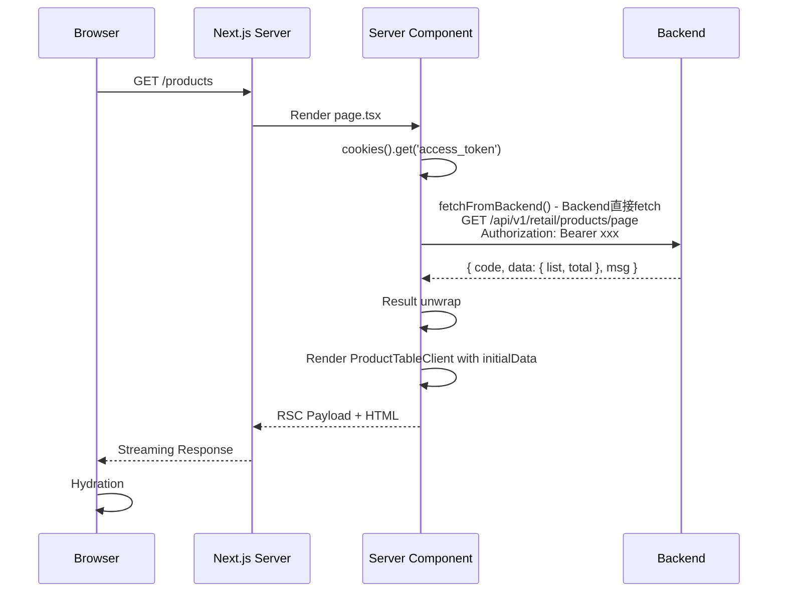
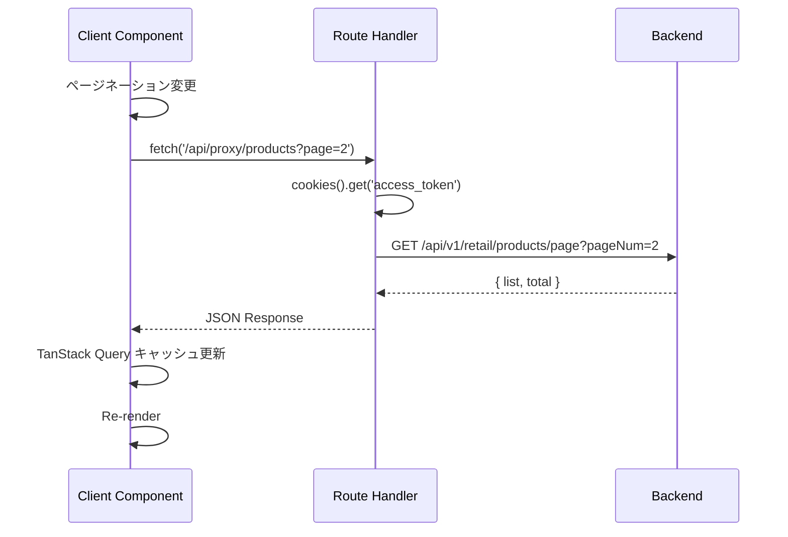
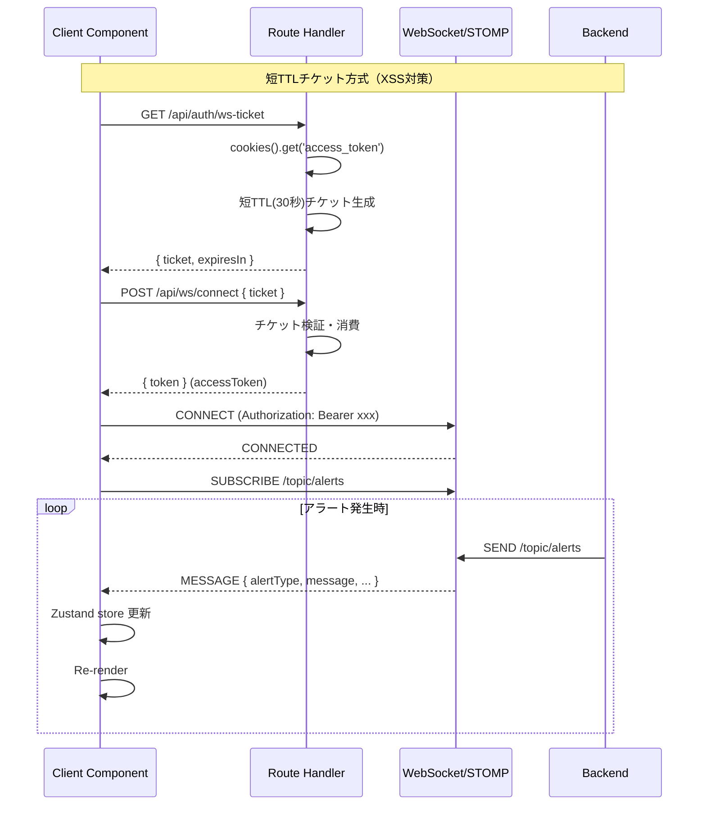
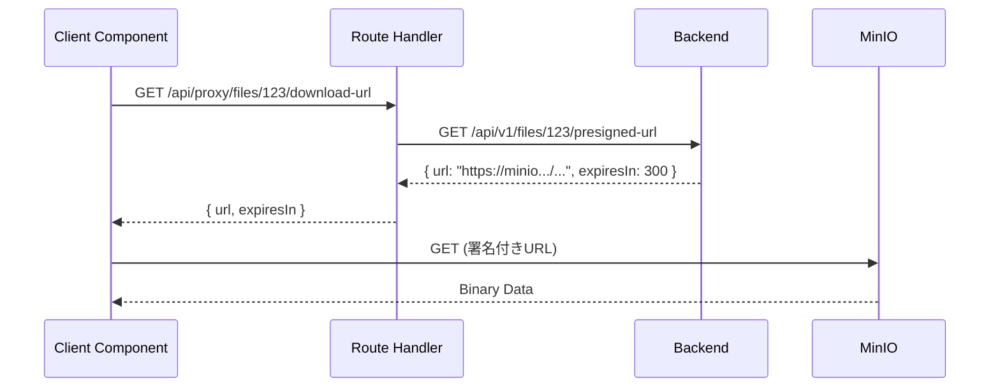

# SmartRetail Pro - Next.js版フロントエンド アーキテクチャ

## システム構成図



## 認証フロー



## データフロー

### 初期ロード（Server Component）



**ポイント**: Server ComponentはRoute Handlerを経由せず、Backend直接fetch（Next.js公式推奨）

### インタラクション後（Client Component）



### リアルタイム更新（STOMP）



## ディレクトリ構成

```
apps/frontend-next/
├── app/                          # App Router
│   ├── (auth)/                   # 認証不要ページ
│   │   ├── login/page.tsx
│   │   └── layout.tsx
│   ├── (dashboard)/              # 認証必須ページ
│   │   ├── layout.tsx            # Sidebar + Header + AuthGuard
│   │   ├── page.tsx              # ダッシュボード
│   │   ├── products/
│   │   │   ├── page.tsx          # 商品一覧 [Server]
│   │   │   ├── [id]/page.tsx     # 商品詳細 [Server]
│   │   │   ├── [id]/edit/page.tsx
│   │   │   └── new/page.tsx
│   │   ├── categories/
│   │   ├── inventory/
│   │   ├── sales/
│   │   └── alerts/
│   │       └── page.tsx          # アラート一覧
│   ├── api/                      # Route Handlers
│   │   ├── auth/
│   │   │   ├── login/route.ts
│   │   │   ├── logout/route.ts
│   │   │   ├── refresh/route.ts
│   │   │   └── ws-token/route.ts
│   │   └── proxy/
│   │       └── [...path]/route.ts
│   ├── globals.css
│   └── layout.tsx
│
├── middleware.ts                 # 認証Middleware（プロジェクトルート）
│
├── features/                     # 機能モジュール
│   ├── auth/
│   │   ├── components/login-form.tsx
│   │   ├── lib/auth-api.ts
│   │   └── types/auth.ts
│   ├── products/
│   │   ├── components/
│   │   │   ├── product-table.tsx
│   │   │   └── product-form.tsx
│   │   ├── hooks/use-products.ts
│   │   ├── lib/product-api.ts
│   │   └── types/product.ts
│   ├── dashboard/
│   │   ├── components/
│   │   │   ├── kpi-cards.tsx
│   │   │   ├── sales-trend-chart.tsx
│   │   │   └── inventory-status.tsx
│   │   └── lib/dashboard-api.ts
│   ├── alerts/
│   │   ├── components/alert-list.tsx
│   │   ├── hooks/
│   │   │   ├── use-stomp.ts
│   │   │   └── use-alert-subscription.ts
│   │   ├── store/alert-store.ts
│   │   └── types/alert.ts
│   └── ...
│
├── components/
│   ├── ui/                       # shadcn/ui
│   ├── layout/
│   │   ├── sidebar.tsx
│   │   ├── header.tsx
│   │   └── breadcrumb.tsx
│   └── providers/
│       ├── query-provider.tsx
│       └── theme-provider.tsx
│
├── lib/
│   ├── api/
│   │   ├── client.ts             # Client Component用
│   │   └── server.ts             # Server Component用
│   └── utils.ts
│
├── store/
│   └── app-store.ts              # グローバル状態（Zustand）
│
└── types/
    └── api.ts                    # 共通API型
```

## 技術選定サマリ

| カテゴリ | 技術 | 採用理由 | 却下案 |
|---------|------|----------|--------|
| フレームワーク | Next.js 15+ (App Router) | RSC、Streaming、Nested Layouts、React 19対応 | Pages Router |
| UI | shadcn/ui + Radix UI | RSC対応、コード所有型、Tailwind v4対応 | Ant Design, MUI |
| スタイル | Tailwind CSS v4 | `@import 'tailwindcss'`、CSS変数ベース設定 | CSS-in-JS |
| サーバー状態 | TanStack Query v5 | キャッシュ自動化、RSC prefetch対応 | SWR |
| クライアント状態 | Zustand v5 | 軽量、TypeScript親和性 | Redux |
| フォーム | React Hook Form + Zod | 型安全バリデーション | Formik |
| テーブル | TanStack Table v8 | ヘッドレス、高機能 | AG Grid |
| チャート | Recharts | React統合、軽量 | Chart.js |
| WebSocket | @stomp/stompjs | 既存バックエンドとの互換性 | Socket.IO |
| アイコン | Lucide React | shadcn/ui標準 | react-icons |
| テーマ | next-themes | ダークモード対応 | - |

### バージョン方針

- create-next-app の推奨デフォルト（Turbopack、App Router）を採用
- Tailwind CSS v4: `tailwindcss @tailwindcss/postcss` + `@import 'tailwindcss'` 構成
- shadcn/ui: Tailwind v4対応版、`npx shadcn@latest init` でセットアップ
- 参照: [Next.js CSS Docs](https://nextjs.org/docs/app/getting-started/css) / [shadcn Tailwind v4](https://ui.shadcn.com/docs/tailwind-v4)

## Server/Client 境界マトリクス

| コンポーネント/ページ | 種別 | データ取得 | 理由 |
|---------------------|------|-----------|------|
| page.tsx (一覧) | Server | fetchWithAuth | 初期データ取得 |
| layout.tsx | Server | - | 静的構造 |
| ProductTable | Client | TanStack Query | ソート、ページング |
| ProductForm | Client | - | フォーム入力 |
| KPICards | Server | fetchWithAuth | 静的表示 |
| SalesTrendChart | Client | - | Recharts |
| AlertList | Client | STOMP | リアルタイム |
| Sidebar | Server | - | 静的ナビゲーション |
| Header | Client | - | ユーザーメニュー |

## API型定義

```typescript
// types/api.ts

/** バックエンドResult<T>のdata部分を直接Tとして扱う */
export type ApiResponse<T> = T;

/** ページネーション結果 */
export interface PageResult<T> {
  list: T[];
  total: number;
}

/** 共通クエリパラメータ */
export interface PageQuery {
  pageNum: number;
  pageSize: number;
}
```

## パフォーマンス考慮事項

### ハイブリッドアプローチ

[Vercel公式ブログ](https://vercel.com/blog/common-mistakes-with-the-next-js-app-router-and-how-to-fix-them)の推奨に従い、Server ComponentからRoute Handlerへの内部fetchを避ける設計を採用:

| コンポーネント | データ取得方法 | トークンリフレッシュ |
|--------------|--------------|-------------------|
| Server Component | Backend直接fetch | なし（401時はログインへ） |
| Client Component | Route Handler経由 | 自動リフレッシュ |

事前トークンリフレッシュ（4分ごと、残り5分で実行）により、Server Componentでの401発生を最小化。

詳細: [ADR-002 ハイブリッドアプローチ](../apps/frontend-next/docs/adr/ADR-002-jwt-authentication.md)

### 重いデータのオフロード

Route Handlerのボトルネック化を防ぐため、以下のケースではBackendから署名付きURLを発行:

- 画像バイナリの取得
- 大容量JSON（レポートデータ等）
- ファイルダウンロード



## 関連ドキュメント

- [ADR-001: App Router採用とディレクトリ方針](../apps/frontend-next/docs/adr/ADR-001-app-router-directory.md)
- [ADR-002: JWT認証](../apps/frontend-next/docs/adr/ADR-002-jwt-authentication.md)
- [ADR-003: Server/Client境界](../apps/frontend-next/docs/adr/ADR-003-server-client-boundary.md)
- [ADR-004: UIライブラリ](../apps/frontend-next/docs/adr/ADR-004-ui-library.md)
- [ADR-005: STOMPリアルタイム](../apps/frontend-next/docs/adr/ADR-005-stomp-realtime.md)
- [ADR-006: Appフォルダ構成](../apps/frontend-next/docs/adr/ADR-006-app-folder-structure.md)
- [ADR-007: 状態管理](../apps/frontend-next/docs/adr/ADR-007-state-management.md)
