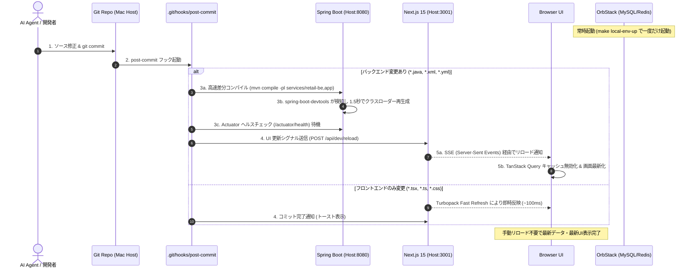

# M5 Mac ローカル AI 駆動開発 UI 自動反映仕様書

> **対象リポジトリ**: `smart-retail-dx` / `smart-dx-backend`  
> **対象環境**: Apple Silicon M5 Mac (64GB RAM), macOS, OrbStack  
> **更新日**: 2026-09-12  
> **ステータス**: 実装・配備完了（Implemented & Verified）  
> **HTML 版**: [`kb/react/10-cicd-deploy/local-ai-dev-auto-reload.html`](file:///Volumes/Dev/Git/learning/kb/react/10-cicd-deploy/local-ai-dev-auto-reload.html)  
> ※ **重要運用ルール**: 本 Markdown（`.md`）修正後は、必ず上記 HTML 版（`kb/react/10-cicd-deploy/`）も同期・更新すること。

---

## 1. 概要と設計思想

### 1.1. 目的
Gemini CLI / Claude Code / Antigravity / Codex 等の AI コーディングアシスタントがコード修正およびコミットを完了した後、開発者がターミナルでの停止・再起動やブラウザのリロードを手動で行うことなく、**最速かつシームレスにブラウザ UI へ修正結果を自動反映させる**。

### 1.2. M5 Mac 最適化アーキテクチャ（Host-Native × Containerized Middleware）
本システム（SmartRetail Pro）では、M5 Mac (64GB) の Apple Silicon ネイティブ処理能力を最大限に活かし、仮想化オーバーヘッドやファイル同期遅延を排除するため、**「ホスト直接実行 ＋ OrbStack インフラ ＋ イベント駆動 UI リロード」** のハイブリッド構成を採用します。

```text
┌─────────────────────────────────────────────────────────────┐
│  M5 Mac ホスト環境（超高速・低遅延）                         │
│                                                             │
│  [AI エージェント / 開発者]                                 │
│        │ 1. ソースコード修正 & 保存                         │
│        ▼                                                    │
│  [ファイル保存]                                             │
│        ├─ Frontend (apps/frontend-next) ───[ Turbopack HMR ]─┐
│        │                                    (即時 100ms)    │
│        │                                                    │
│        └─ Backend (smart-dx-backend)                        │
│             │                                               │
│             ▼                                               │
│        [2. git commit (修正完了コミット)]                   │
│             │                                               │
│             ▼                                               │
│        [post-commit フック]                                 │
│             │                                               │
│             ├─ (A) Backend 差分ビルド (mvn compile)         │
│             │      → spring-boot-devtools が検知 (1.5秒)    │
│             │      → /actuator/health 待機                  │
│             │                                               │
│             └─ (B) UI 更新シグナル送信 (POST /api/dev/reload)│
│                    │                                        │
│                    ▼                                        │
│           [ブラウザ UI: TanStack Query キャッシュ自動無効化] │
│           (画面状態・入力を保持したまま最新データ再描画)     ▲
│                                                     │       │
└─────────────────────────────────────────────────────┼───────┘
                                                      │
┌─────────────────────────────────────────────────────┼───────┐
│  OrbStack Docker（常時起動インフラ）                │
│  - MySQL 8.0 (3306)                                         │
│  - Redis 7.2 (6379)                                         │
│  - OpenSearch 2.19 (9200)                                   │
│  - PowerJob Server (7700)                                   │
└─────────────────────────────────────────────────────────────┘
```

---

## 2. サービス構成とポート一覧

| レイヤー | サービス名 | 実行環境 | ポート | 役割 / 備考 |
| :--- | :--- | :--- | :--- | :--- |
| **Frontend** | `frontend-next` | Mac ホスト (`pnpm dev`) | `3001` | Next.js 15 App Router, React 19, Turbopack |
| **Backend** | `smart-dx-app` | Mac ホスト (`mvn spring-boot:run`) | `8080` | Spring Boot 3.3.6, Java 21, DevTools 有効 |
| **Database** | `smart-retail-mysql-8` | OrbStack Docker | `3306` | MySQL 8.0 (`smart_dx_db`), 常時起動 |
| **Cache** | `smart-dx-redis` | OrbStack Docker | `6379` | Redis 7.2, 常時起動 |
| **Search** | `smart-dx-opensearch` | OrbStack Docker | `9200` | OpenSearch 2.19.1, 常時起動 |
| **Job Engine** | `smart-retail-powerjob` | OrbStack Docker | `7700` | PowerJob Server, 常時起動 |

> [!NOTE]
> 既存の Vue 3 版（`apps/frontend`）はレガシー参照用です。新機能・UI 開発はすべて `apps/frontend-next`（Next.js 15）で行います。

---

## 3. UI 自動反映のシーケンス詳細



---

## 4. 実装仕様と設定コード

### 4.1. バックエンド：`spring-boot-devtools` による高速リスタート

#### (1) `pom.xml` への依存および開発クラスパス追加
実体リポジトリ `smart-dx-backend/apps/backend/app/pom.xml` にて、DevTools 依存を追加するとともに、`spring-boot-maven-plugin` の `<folders>` 設定で各サービスモジュールの `target/classes` を開発クラスパスに含めます（これによりローカル JAR ではなく最新の差分ビルドクラスが即時ロードされます）：

```xml
<!-- apps/backend/app/pom.xml (dependencies) -->
<dependency>
    <groupId>org.springframework.boot</groupId>
    <artifactId>spring-boot-devtools</artifactId>
    <scope>runtime</scope>
    <optional>true</optional>
</dependency>

<!-- apps/backend/app/pom.xml (plugins) -->
<plugin>
    <groupId>org.springframework.boot</groupId>
    <artifactId>spring-boot-maven-plugin</artifactId>
    <configuration>
        <folders>
            <folder>${project.basedir}/../services/retail-be/target/classes</folder>
            <folder>${project.basedir}/../services/system-be/target/classes</folder>
            <folder>${project.basedir}/../services/property-be/target/classes</folder>
        </folders>
    </configuration>
</plugin>
```

#### (2) 開発用設定 (`application.yml` の dev プロファイル)
`apps/backend/app/src/main/resources/application.yml` の `on-profile: dev` セクションに以下を設定：

```yaml
spring:
  config:
    activate:
      on-profile: dev
  devtools:
    restart:
      enabled: true
      poll-interval: 500ms
      quiet-period: 200ms
      additional-paths:
        - ../services/retail-be/target/classes
        - ../services/system-be/target/classes
        - ../services/property-be/target/classes
```

---

### 4.2. フロントエンド：開発用 UI 自動反映 Route & コンポーネント

#### (1) SSE リロード通知 Route Handler
配置場所: `apps/frontend-next/app/api/dev/reload/route.ts`

```typescript
import { NextResponse } from 'next/server';

type Listener = (data: string) => void;
const listeners = new Set<Listener>();

export const dynamic = 'force-dynamic';

export async function GET() {
  if (process.env.NODE_ENV !== 'development') {
    return new NextResponse('Forbidden', { status: 403 });
  }

  let currentListener: Listener;
  const stream = new ReadableStream({
    start(controller) {
      currentListener = (data: string) => {
        try {
          controller.enqueue(new TextEncoder().encode(`data: ${data}\n\n`));
        } catch {}
      };
      listeners.add(currentListener);
      controller.enqueue(new TextEncoder().encode(`data: ${JSON.stringify({ action: 'connected' })}\n\n`));
    },
    cancel() {
      if (currentListener) listeners.delete(currentListener);
    },
  });

  return new NextResponse(stream, {
    headers: {
      'Content-Type': 'text/event-stream',
      'Cache-Control': 'no-cache, no-transform',
      Connection: 'keep-alive',
    },
  });
}

export async function POST(req: Request) {
  if (process.env.NODE_ENV !== 'development') {
    return new NextResponse('Forbidden', { status: 403 });
  }

  const payload = await req.json().catch(() => ({ action: 'refetch' }));
  const message = JSON.stringify(payload);

  listeners.forEach((listener) => {
    try {
      listener(message);
    } catch {
      listeners.delete(listener);
    }
  });

  return NextResponse.json({ success: true, clientCount: listeners.size });
}
```

#### (2) ブラウザ側リスナーコンポーネント
配置場所: `apps/frontend-next/components/dev-auto-reload.tsx`

```tsx
/* eslint-disable no-console */
'use client';

import { useEffect, useRef } from 'react';
import { useQueryClient } from '@tanstack/react-query';
import { toast } from 'sonner';

export function DevAutoReload() {
  const queryClient = useQueryClient();
  const eventSourceRef = useRef<EventSource | null>(null);

  useEffect(() => {
    if (process.env.NODE_ENV !== 'development') return;

    let isUnmounted = false;

    function connect() {
      if (isUnmounted) return;
      const es = new EventSource('/api/dev/reload');
      eventSourceRef.current = es;

      es.onmessage = (event) => {
        try {
          const data = JSON.parse(event.data);
          if (data.action === 'connected') return;

          if (data.action === 'refetch') {
            queryClient.invalidateQueries();
            toast.success('データ自動更新', {
              description: data.reason || 'バックエンド修正を反映しました',
              duration: 3000,
            });
          } else if (data.action === 'hard-reload') {
            window.location.reload();
          }
        } catch (e) {
          console.error('[DevAutoReload] Parse error:', e);
        }
      };

      es.onerror = () => {
        es.close();
        if (!isUnmounted) setTimeout(connect, 3000);
      };
    }

    connect();

    return () => {
      isUnmounted = true;
      if (eventSourceRef.current) eventSourceRef.current.close();
    };
  }, [queryClient]);

  return null;
}
```

#### (3) 既存 Providers への組み込み
`apps/frontend-next/components/providers/index.tsx` 内で、`QueryProvider` の子コンポーネントとして組み込みます（これにより `useQueryClient` の Context が安全に供給されます）。

```tsx
// apps/frontend-next/components/providers/index.tsx
import { QueryProvider } from './query-provider';
import { ThemeProvider } from './theme-provider';
import { Toaster } from 'sonner';
import { DevAutoReload } from '@/components/dev-auto-reload';

export function Providers({ children }: ProvidersProps) {
  return (
    <QueryProvider>
      <ThemeProvider>
        {children}
        {process.env.NODE_ENV === 'development' && <DevAutoReload />}
        <Toaster position="top-right" richColors />
      </ThemeProvider>
    </QueryProvider>
  );
}
```

---

### 4.3. トリガー機構：Git `post-commit` フック

Git でコミットが完了した瞬間に自動実行されるスクリプトです。  
`smart-retail-dx` と `smart-dx-backend` の**両リポジトリの `.git/hooks/post-commit` に配備**され、いずれのリポジトリでコミットが発生しても正常に動作します。  
正本配置場所: `_scripts/git-hooks/post-commit`（実行権限 `chmod +x` が必要）

```bash
#!/bin/bash
# ==============================================================================
# SmartRetail Pro - Post-Commit Auto Reload Hook (M5 Mac Optimized)
# Supports execution from both smart-retail-dx and smart-dx-backend repositories.
# ==============================================================================

CHANGED_FILES=$(git diff-tree -r --name-only --no-commit-id HEAD 2>/dev/null)
if [ -z "$CHANGED_FILES" ]; then exit 0; fi

echo "🔄 [Post-Commit] Analyzing changed files for automatic UI update..."

BE_CHANGED=false
FE_CHANGED=false

REPO_NAME=$(basename "$(git rev-parse --show-toplevel 2>/dev/null)")

if [ "$REPO_NAME" = "smart-dx-backend" ]; then
  BE_CHANGED=true
else
  for file in $CHANGED_FILES; do
    if [[ "$file" =~ ^apps/backend/ || "$file" =~ ^smart-dx-backend/ ]]; then BE_CHANGED=true; fi
    if [[ "$file" =~ ^apps/frontend-next/ ]]; then FE_CHANGED=true; fi
  done
fi

# バックエンドに変更がある場合
if [ "$BE_CHANGED" = true ]; then
  BACKEND_DIR="/Volumes/Dev/Git/vps/smart-dx-backend/apps/backend"
  if [ ! -d "$BACKEND_DIR" ]; then BACKEND_DIR="$(pwd)/apps/backend"; fi

  if curl -sf --connect-timeout 2 --max-time 2 http://localhost:8080/actuator/health > /dev/null 2>&1; then
    echo "☕ [Post-Commit] Backend changes detected. Running fast-compilation..."
    
    PRE_UPTIME=$(curl -sf --connect-timeout 2 --max-time 2 http://localhost:8080/actuator/metrics/process.uptime 2>/dev/null | grep -o '"value":[0-9.]*' | cut -d: -f2 | cut -d. -f1 || echo "0")

    COMPILE_OUTPUT=$(cd "$BACKEND_DIR" && mvn compile -pl services/retail-be,services/system-be,services/property-be,app -DskipTests -q 2>&1)
    COMPILE_STATUS=$?

    if [ $COMPILE_STATUS -ne 0 ]; then
      echo "❌ [Post-Commit] Compilation failed! Skipping reload."
      echo "$COMPILE_OUTPUT"
      exit 1
    fi

    echo "⏳ [Post-Commit] Waiting for Spring Boot DevTools restart (detected uptime reset)..."
    RELOADED=false
    for i in {1..20}; do
      sleep 0.5
      CUR_UPTIME=$(curl -sf --connect-timeout 1 --max-time 1 http://localhost:8080/actuator/metrics/process.uptime 2>/dev/null | grep -o '"value":[0-9.]*' | cut -d: -f2 | cut -d. -f1 || echo "")
      
      if [ -n "$CUR_UPTIME" ]; then
        if [ "$CUR_UPTIME" -lt "$PRE_UPTIME" ] || [ "$CUR_UPTIME" -lt 10 ]; then
          if curl -sf --connect-timeout 1 --max-time 1 http://localhost:8080/actuator/health > /dev/null 2>&1; then
            RELOADED=true
            break
          fi
        fi
      fi
    done

    if [ "$RELOADED" = true ]; then
      echo "✅ [Post-Commit] Spring Boot successfully hot-reloaded!"
      if curl -sf --connect-timeout 1 --max-time 1 http://localhost:3001/api/dev/reload > /dev/null 2>&1; then
        NOTIFY_RES=$(curl -s -X POST http://localhost:3001/api/dev/reload \
          --connect-timeout 2 --max-time 3 \
          -H "Content-Type: application/json" \
          -d '{"action": "refetch", "reason": "Backend modified & hot-reloaded"}' 2>/dev/null)
        echo "🌐 [Post-Commit] Browser UI notified via SSE: $NOTIFY_RES"
      else
        echo "ℹ️  [Post-Commit] Frontend (http://localhost:3001) is not running. Browser notification skipped."
      fi
    else
      echo "⚠️  [Post-Commit] Timeout waiting for backend reload. Check logs in /tmp/smart-retail-backend.log"
    fi
  else
    echo "ℹ️  [Post-Commit] Backend is not currently running on :8080. Skipping reload."
  fi
fi

# フロントエンドに変更がある場合
if [ "$FE_CHANGED" = true ]; then
  if curl -sf --connect-timeout 1 --max-time 1 http://localhost:3001/api/dev/reload > /dev/null 2>&1; then
    echo "⚡ [Post-Commit] Frontend committed. Notifying browser UI..."
    curl -s -X POST http://localhost:3001/api/dev/reload \
      --connect-timeout 2 --max-time 3 \
      -H "Content-Type: application/json" \
      -d '{"action": "refetch", "reason": "Frontend committed"}' > /dev/null 2>&1
    echo "✅ [Post-Commit] Browser UI notified of frontend commit!"
  fi
fi

exit 0
```

---

### 4.4. 開発起動ワンコマンドスクリプト（`./dev.sh`）

開発開始時は、リポジトリルートで `./dev.sh` を実行するだけで全環境（両リポジトリのフック配備、インフラ起動、BE/FE 起動）が整います。  
配置場所: `./dev.sh`（実行権限 `chmod +x ./dev.sh`）

```bash
#!/bin/bash
# ==============================================================================
# ./dev.sh - SmartRetail Pro ローカル開発一括起動スクリプト (M5 Mac Native)
# ==============================================================================
set -e

PROJECT_ROOT="$(cd "$(dirname "${BASH_SOURCE[0]}")" && pwd)"
BACKEND_REPO="/Volumes/Dev/Git/vps/smart-dx-backend"

echo "================================================================================"
echo "🚀 SmartRetail Pro Local AI-Driven Development (M5 Mac Native)"
echo "================================================================================"

# 0. Git Hook の両リポジトリ自動セットアップ
setup_hooks() {
  echo "🔧 [0/3] Checking post-commit auto-reload hooks..."
  mkdir -p "$PROJECT_ROOT/.git/hooks"
  cp "$PROJECT_ROOT/_scripts/git-hooks/post-commit" "$PROJECT_ROOT/.git/hooks/post-commit"
  chmod +x "$PROJECT_ROOT/.git/hooks/post-commit"

  if [ -d "$BACKEND_REPO/.git" ]; then
    mkdir -p "$BACKEND_REPO/.git/hooks"
    cp "$PROJECT_ROOT/_scripts/git-hooks/post-commit" "$BACKEND_REPO/.git/hooks/post-commit"
    chmod +x "$BACKEND_REPO/.git/hooks/post-commit"
    echo "   ==> Hooks installed in both smart-retail-dx and smart-dx-backend. ✅"
  fi
}
setup_hooks

# 1. OrbStack インフラコンテナの確認 & 起動
echo "📦 [1/3] Ensuring local infrastructure containers (OrbStack)..."
cd "$PROJECT_ROOT/platform/docker"

BASEPATH_CHECK="/mydata"
if [ ! -d "$BASEPATH_CHECK" ]; then
  echo "   ⚠️ $BASEPATH_CHECK not found. Running initial setup (make local-setup)..."
  make local-setup || true
fi

docker compose -f docker-compose-env.yml up -d

echo "   ==> Waiting for MySQL readiness..."
RETRY=0
until docker compose -f docker-compose-env.yml ps smart-retail-mysql 2>/dev/null | grep -q "(healthy)" || [ $RETRY -ge 15 ]; do
  sleep 1
  RETRY=$((RETRY + 1))
done
echo "   ==> Infrastructure ready. ✅"

# 2. バックエンド起動 (Spring Boot 3.3 / Port 8080)
echo "☕ [2/3] Checking Spring Boot Backend..."
BACKEND_DIR="$BACKEND_REPO/apps/backend"
if [ ! -d "$BACKEND_DIR" ]; then
  BACKEND_DIR="$PROJECT_ROOT/apps/backend"
fi

BE_PID=""
if curl -sf --connect-timeout 1 --max-time 1 http://localhost:8080/actuator/health > /dev/null 2>&1; then
  echo "   ==> Backend already running on http://localhost:8080. ✅"
else
  echo "   ==> Starting Spring Boot backend with DevTools (logs: /tmp/smart-retail-backend.log)..."
  pkill -f "smart-dx-app" 2>/dev/null || true
  (cd "$BACKEND_DIR" && nohup mvn spring-boot:run -pl app -Dspring-boot.run.profiles=dev > /tmp/smart-retail-backend.log 2>&1 &)
  BE_PID=$!
  echo "   ==> Backend launched (PID: $BE_PID). Waiting for health check..."
  
  RETRY=0
  until curl -sf --connect-timeout 1 --max-time 1 http://localhost:8080/actuator/health > /dev/null 2>&1 || [ $RETRY -ge 35 ]; do
    sleep 1
    RETRY=$((RETRY + 1))
    printf "."
  done
  echo ""
  if curl -sf --connect-timeout 1 --max-time 1 http://localhost:8080/actuator/health > /dev/null 2>&1; then
    echo "   ==> Backend is healthy on http://localhost:8080! ✅"
  else
    echo "   ⚠️ Backend launch taking longer than expected. Check logs: tail -f /tmp/smart-retail-backend.log"
  fi
fi

# サブコマンド対応 (status / stop)
if [ "$1" = "stop" ]; then
  echo "🛑 Stopping SmartRetail Pro local development processes..."
  pkill -f "next-server" 2>/dev/null || true
  pkill -f "pnpm dev" 2>/dev/null || true
  pkill -f "smart-dx-app" 2>/dev/null || true
  echo "   ==> Backend & Frontend processes stopped. (Infra containers kept running)"
  exit 0
fi

if [ "$1" = "status" ]; then
  echo "📊 Service Status:"
  echo -n "   - Infrastructure (MySQL): "
  if docker compose -f "$PROJECT_ROOT/platform/docker/docker-compose-env.yml" ps smart-retail-mysql 2>/dev/null | grep -q "healthy"; then
    echo "Running (Healthy) ✅"
  else
    echo "Stopped or Unhealthy ❌"
  fi
  echo -n "   - Backend (Spring Boot 8080): "
  if curl -sf --connect-timeout 1 --max-time 1 http://localhost:8080/actuator/health > /dev/null 2>&1; then
    echo "Running (Healthy) ✅"
  else
    echo "Not running ❌"
  fi
  echo -n "   - Frontend (Next.js 3001): "
  if curl -sf --connect-timeout 1 --max-time 1 http://localhost:3001/api/health > /dev/null 2>&1; then
    echo "Running (Healthy) ✅"
  else
    echo "Not running ❌"
  fi
  echo -n "   - End-to-End Connectivity: "
  HEALTH_JSON=$(curl -sf --connect-timeout 2 --max-time 2 http://localhost:3001/api/health 2>/dev/null || true)
  if echo "$HEALTH_JSON" | grep -q '"backend":{"status":"ok"'; then
    echo "Connected (FE -> BE: OK) ✅"
  else
    echo "Disconnected ❌"
  fi
  exit 0
fi

cleanup() {
  echo ""
  echo "🛑 Stopping local development processes..."
  if [ -n "$BE_PID" ]; then
    kill "$BE_PID" 2>/dev/null || true
  fi
  exit 0
}
trap cleanup SIGINT SIGTERM

# 3. フロントエンド起動 (Next.js 15 Turbopack / Port 3001)
echo "⚡ [3/3] Checking Next.js 15 Frontend on http://localhost:3001..."
if curl -sf --connect-timeout 1 --max-time 1 http://localhost:3001/api/health > /dev/null 2>&1; then
  echo "   ==> Frontend already running on http://localhost:3001. ✅"
  echo "--------------------------------------------------------------------------------"
  echo "✨ 全サービス（インフラ、バックエンド、フロントエンド）が正常に稼働中です！"
  echo "   - Frontend: http://localhost:3001"
  echo "   - Backend:  http://localhost:8080"
  echo "   - API Docs: http://localhost:8080/doc.html"
  echo "   AI がコード修正・コミット後、ブラウザ画面は自動的にリフレッシュされます。"
  echo "--------------------------------------------------------------------------------"
  exit 0
fi

echo "   ==> Starting Next.js 15 Frontend..."
echo "--------------------------------------------------------------------------------"
echo "💡 AI がコード修正・コミット後、ブラウザ画面は自動的にリフレッシュされます。"
echo "   終了時は Ctrl+C を押してください。"
echo "--------------------------------------------------------------------------------"

cd "$PROJECT_ROOT/apps/frontend-next"
pnpm dev
```

### `./dev.sh` コマンド一覧
```bash
./dev.sh         # 通常起動（インフラ・BE・FEを一括確認＆起動）
./dev.sh status  # インフラ・BE・FEの死活および疎通状態（Connected）を確認
./dev.sh stop    # ホスト上で起動中の BE・FE プロセスを停止（インフラコンテナは維持）
```

---

## 5. 日常の AI 協調開発ワークフロー

```text
1. 開発開始
   $ ./dev.sh
   （ブラウザで http://localhost:3001 を開く）

2. AI へ修正依頼
   「商品一覧画面に在庫ステータスのアラートバッジを追加し、該当APIも更新してください」

3. AI がコード編集・保存
   - TSX/CSS 保存時 : Next.js Turbopack により、ブラウザが 100ms で即座に部分更新

4. AI がテスト実行 & コミット
   $ git commit -m "feat(retail): add stock status badge and update api"

5. 自動反映パイプライン起動（手動操作ゼロ）
   - post-commit フックがバックエンドを差分コンパイル（1.5秒）
   - DevTools が Spring Boot をホットリスタート
   - フックが SSE 通知エンドポイント（/api/dev/reload）を叩く
   - Next.js 画面が自動リフレッシュされ、最新データ・UI が表示される！
```

---

## 6. 禁止事項とトラブルシューティング

### 6.1. 禁止事項
- ❌ **修正のたびに `docker compose down / up` を実行しない**
- ❌ **ソース修正時に MySQL や Redis を再起動しない**
- ❌ **`apps/frontend`（旧 Vue 版）を編集しない**

### 6.2. トラブルシューティング
- **ブラウザが自動リロードされない場合**:
  - `http://localhost:3001` がブラウザで開かれており、開発者ツールの Console に `[DevAutoReload] Connected to dev-reload SSE stream` と出力されているか確認。
- **Spring Boot がホットリロードしない場合**:
  - `cd apps/backend && mvn compile -pl services/retail-be,app` を実行し、コンパイルエラーがないか確認。
- **インフラコンテナが停止している場合**:
  - `cd platform/docker && make local-env-up` で一括再起動。
- **環境全体の疎通確認**:
  - `./dev.sh status` を実行し、End-to-End Connectivity が `Connected (FE -> BE: OK) ✅` になっているか確認。

---

## 7. 改訂履歴

| 日付 | 改訂者 | 内容 |
| :--- | :--- | :--- |
| 2026/09/12 | codex | 初版作成。M5 Mac 64GB ローカル AI 駆動開発 UI 自動反映アーキテクチャの正本仕様策定。 |
| 2026/09/12 | codex | HTML版の配置先を `kb/react/10-cicd-deploy/` へ移動し、md/HTML同期ルールを追記。 |
| 2026/09/12 | codex | Codex再レビュー指摘対応完了（NextResponse import修正、Providers内マウント、foldersクラスパス追加、uptime判定・エラー分岐強化、両リポジトリフック配備、dev.sh改善）。実装および動作検証完了。 |
| 2026/09/12 | codex | FE/BE 正常疎通対応完了（`BACKEND_URL` 設定、Actuator フォールバック、`application.yml` 認証例外追加、`dev.sh status/stop` 追加）。E2E 疎通動作確認完了。 |


