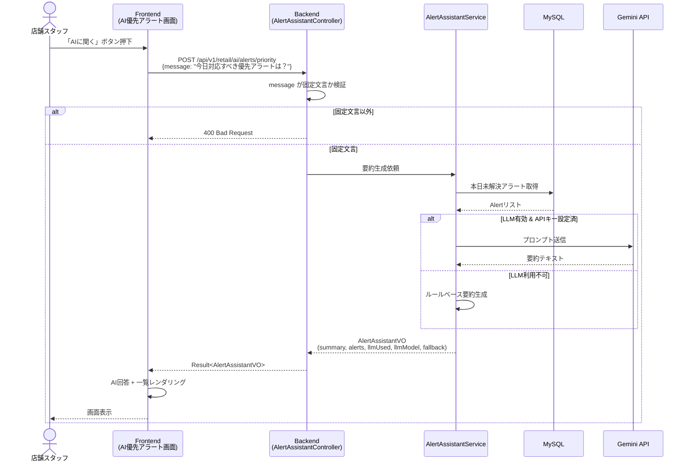

# Smart Retail DX - AI 優先アラートアシスタント設計書

**ドキュメントID**: DES-AI-ALERT-001  
**バージョン**: 1.0.1  
**作成日**: 2026/06/22  
**最終更新日**: 2026/06/23  
**ステータス**: Draft  
**対象機能**: AI-007-A「アラート対応」ナロースコープ版  
**AI基盤**: Google Gemini Flash 系モデル

---

## 1. 概要

### 1.1 目的

本設計書は、Smart Retail DX における AI 運用アシスタントのうち、**アラート対応の問い「今日対応すべき優先アラートは？」のみ**を対象とした機能の設計を定義する。既存の `docs/design/smart-retail-ai.md`（AI-007: RAG運用アシスタント）の質問例の一つを切り出し、最小限のスコープで実装可能な形に詳細化する。

### 1.2 スコープ

| 対象 | 内容 |
|------|------|
| 対象システム | smart-retail-dx |
| 対象ユーザー | 店舗スタッフ、エリアマネージャー |
| 対応質問 | **「今日対応すべき優先アラートは？」のみ** |
| AI基盤 | Google Gemini API（`gemini-2.0-flash-001` 等の Flash モデル） |
| 非対応 | 他の自然言語質問（在庫分析、売上分析等）は AI-007 本実装で対応 |

### 1.3 用語定義

| 用語 | 定義 |
|------|------|
| Gemini Flash | Google Gemini の軽量・高速・低コストモデル群（`gemini-2.0-flash-001` 等） |
| 優先アラート | 優先度 P1（緊急）→ P4（低）でソートした本日発生・未対応のアラート |
| フォールバック | LLM 利用不可時に Java 側で機械的に生成する要約 |

### 1.4 Gemini Flash を選択した理由

`smart-retail-ai.md` では AI-007 全体として Kimi API（Primary）/ Claude API（Fallback）を想定しているが、本設計書は以下の理由から Google Gemini Flash 系モデルを採用する。

- **軽量・低コスト**: Flash モデルは短いプロンプトの要約タスクに十分な性能であり、運用コストを抑えられる
- **応答速度**: 短い入力に対して数秒以内に応答可能
- **日本語対応**: Gemini シリーズは日本語でも安定した出力が得られる
- **API アクセスの簡便さ**: Google AI Studio の API キーだけで利用開始でき、運用負荷が低い

AI-007 本実装（RAG・長文コンテキスト）では引き続き Kimi / Claude を検討する。

---

## 2. ユースケース

```
👤 オペレーター: 「今日対応すべき優先アラートは？」

🤖 AI Assistant:
「本日は緊急アラート 2件、高優先アラート 1件です。

🔴 優先度1: 渋谷店 おにぎり（鮭）在庫切れ（P1 / LOW_STOCK）
  → 即時補充を推奨。次回配送枠は本日14時です。

🟠 優先度2: 池袋店 サンドイッチ賞味期限接近（P2 / EXPIRY_SOON）
  → 20%値引き設定を検討してください。

🟡 優先度3: 品川店 ドリンク類在庫過多（P3 / HIGH_STOCK）
  → 明日の配送調整を確認してください。

📊 根拠データ：本日 00:00 以降の未解決アラート（P1:2件 / P2:1件 / P3:1件 / P4:0件）
🔗 関連：[/retail/alert/list アラート一覧]」
```

> **注記**: 本機能で扱うアラートタイプは Phase 1 対応の `LOW_STOCK` / `EXPIRY_SOON` / `HIGH_STOCK` を想定する。`PAYMENT_TERMINAL_DOWN` 等の Phase 2 アラートは例示には使用しない。

---

## 3. 機能要件

### 3.1 バックエンド要件

| ID | 要件 | 優先度 |
|----|------|--------|
| AA-BE-001 | 固定質問「今日対応すべき優先アラートは？」のみ受け付けること | 必須 |
| AA-BE-002 | 本日 00:00 以降かつ未解決（CLOSED/RESOLVED 以外）のアラートを取得すること | 必須 |
| AA-BE-003 | 取得したアラートを優先度 P1→P4、検出時刻降順でソートすること | 必須 |
| AA-BE-004 | Gemini API を用いてアラートの優先度付き要約を生成すること | 必須 |
| AA-BE-005 | LLM 利用不可時はルールベースのフォールバック要約を返すこと | 必須 |
| AA-BE-006 | 応答に LLM 使用有無・モデル名・フォールバックフラグを含めること | 推奨 |
| AA-BE-007 | API 呼び出しを監査ログに記録すること | **必須** |

### 3.2 フロントエンド要件

| ID | 要件 | 優先度 |
|----|------|--------|
| AA-FE-001 | サイドメニュー「アラート」配下に「AI優先アラート」画面を追加すること | 必須 |
| AA-FE-002 | 入力欄にデフォルトで「今日対応すべき優先アラートは？」を表示すること | 必須 |
| AA-FE-003 | 「AIに聞く」ボタンで API を呼び出し、応答を表示すること | 必須 |
| AA-FE-004 | 読み込み中はスケルトン表示すること | 推奨 |
| AA-FE-005 | AI要約と優先アラート一覧の両方を表示すること | 必須 |
| AA-FE-006 | 固定質問以外は送信前にエラーを表示すること | 推奨 |

---

## 4. システム設計

### 4.1 構成図

```
┌─────────────────────────────────────────┐
│  Frontend (Vue 3 + Element Plus)        │
│  ┌─────────────────────────────────┐   │
│  │  AI優先アラート画面              │   │
│  │  - 質問入力欄                   │   │
│  │  - AI回答カード                 │   │
│  │  - 優先アラート一覧テーブル     │   │
│  └─────────────────────────────────┘   │
└─────────────────┬───────────────────────┘
                  │ POST /api/v1/retail/ai/alerts/priority
┌─────────────────▼───────────────────────┐
│  Backend (Spring Boot / retail-be)      │
│  ┌─────────────────────────────────┐   │
│  │  AlertAssistantController        │   │
│  │  - 入力検証（固定質問のみ許可） │   │
│  └─────────────────────────────────┘   │
│  ┌─────────────────────────────────┐   │
│  │  AlertAssistantService           │   │
│  │  - 本日アラート取得             │   │
│  │  - プロンプト構築               │   │
│  │  - Gemini呼び出し or フォールバック │ │
│  └─────────────────────────────────┘   │
│  ┌─────────────────────────────────┐   │
│  │  GeminiLlmClient                 │   │
│  │  - Google Gemini REST API        │   │
│  └─────────────────────────────────┘   │
└─────────────────┬───────────────────────┘
                  │ HTTPS
┌─────────────────▼───────────────────────┐
│  Google Gemini API                      │
│  (gemini-2.0-flash-001)                 │
└─────────────────────────────────────────┘
```

### 4.2 シーケンス図



---

## 5. API 設計

### 5.1 エンドポイント

| 項目 | 内容 |
|------|------|
| Method | POST |
| Path | `/api/v1/retail/ai/alerts/priority` |
| Content-Type | application/json |
| 認証 | Bearer JWT（既存セキュリティ適用） |

### 5.2 リクエスト

```json
{
  "message": "今日対応すべき優先アラートは？"
}
```

| フィールド | 型 | 必須 | 説明 |
|-----------|-----|------|------|
| message | string | ○ | 質問文。固定値「今日対応すべき優先アラートは？」のみ許可 |

### 5.3 レスポンス

```json
{
  "code": "00000",
  "data": {
    "summary": "本日は緊急アラート 2件、高優先アラート 1件です。\n\n1. 渋谷店 おにぎり（鮭）在庫切れ → 即時補充を推奨\n2. 池袋店 サンドイッチ賞味期限接近 → 20%値引きを検討",
    "alerts": [
      {
        "id": 101,
        "storeId": 1,
        "storeName": "渋谷店",
        "productId": 12,
        "productName": "おにぎり（鮭）",
        "productCode": "ONIGIRI-SALMON",
        "alertType": "LOW_STOCK",
        "priority": "P1",
        "status": "NEW",
        "message": "在庫が閾値を下回りました",
        "detectedAt": "2026-06-22 08:12:00"
      }
    ],
    "llmUsed": true,
    "llmModel": "gemini-2.0-flash-001",
    "fallback": false
  },
  "msg": "ok"
}
```

| フィールド | 型 | 説明 |
|-----------|-----|------|
| summary | string | AI 生成（またはフォールバック）の日本語要約 |
| alerts | AlertPageVO[] | 既存 `AlertPageVO` を再利用。優先度順ソート済みのアラート一覧 |
| llmUsed | boolean | LLM を使用したか |
| llmModel | string | 使用モデル名（未使用時は null） |
| fallback | boolean | フォールバック応答か |

> **注記**: `alerts` は既存の `AlertPageVO`（`com.smartdx.retail.model.vo.AlertPageVO`）をそのまま再利用する。既存のアラート一覧 API と同じフィールド構成を持つため、フロントエンドでも既存型定義を流用可能。

### 5.4 エラーレスポンス

| ケース | HTTP Status | 説明 |
|--------|-------------|------|
| message が固定文言と異なる | 400 | 「この質問には対応していません」 |
| 認証エラー | 401 | 既存 JWT 認証準拠 |
| LLM タイムアウト | 200（fallback=true） | フォールバック要約を返す |

---

## 6. UI 設計

### 6.1 画面遷移

```
[サイドメニュー: アラート]
   ├─ アラート一覧 (/retail/alert/list)
   └─ AI優先アラート (/retail/alert/assistant)  ← 新規
```

> **注記**: 本機能の UI 詳細は本設計書を正とする。`docs/design/ui/smart-retail-ui-design.md` への追加は本機能実装時に任意で行う。

### 6.2 画面レイアウト

```
┌─────────────────────────────────────────────────────────────────┐
│ アラート > AI優先アラート                                        │
├─────────────────────────────────────────────────────────────────┤
│                                                                 │
│  ┌─────────────────────────────────────────────────────────┐   │
│  │  今日対応すべき優先アラートは？        [ AIに聞く ]     │   │
│  └─────────────────────────────────────────────────────────┘   │
│                                                                 │
│  ┌─ AI回答（要約）─────────────────────────────────────────┐   │
│  │ 本日は緊急アラートが 2件、高優先が 1件です。             │   │
│  │                                                          │   │
│  │ 1. 渋谷店：おにぎり（鮭）在庫切れ → 即時補充を推奨       │   │
│  │ 2. 池袋店：サンドイッチ賞味期限接近 → 値引き対応を検討 │   │
│  │                                                          │   │
│  │ model: gemini-2.0-flash-001                              │   │
│  └─────────────────────────────────────────────────────────┘   │
│                                                                 │
│  ┌─ 優先アラート一覧 ──────────────────────────────────────┐   │
│  │ 優先度 │ 種別          │ 店舗   │ 商品/内容        │ 検出時刻 │   │
│  │ 🔴 P1  │ LOW_STOCK     │ 渋谷店 │ おにぎり（鮭）   │ 08:12    │   │
│  │ 🟠 P2  │ EXPIRY_SOON   │ 池袋店 │ サンドイッチ      │ 10:03    │   │
│  └─────────────────────────────────────────────────────────┘   │
│                                                                 │
└─────────────────────────────────────────────────────────────────┘
```

### 6.3 コンポーネント対応表

| 画面要素 | Element Plus コンポーネント | 備考 |
|----------|----------------------------|------|
| 質問入力欄 | `el-input` | デフォルト値固定、末尾に送信ボタン |
| 送信ボタン | `el-button type="primary"` | ローディング状態あり |
| ローディング | `el-skeleton` | API 応答待ち時 |
| AI回答カード | `el-card` | 要約テキスト表示 |
| アラート一覧 | `el-table` | 既存アラート一覧と同じカラム構成 |
| 優先度タグ | `el-tag` | P1=danger, P2=warning, P3=info, P4=info |

### 6.4 ルート定義

```typescript
{
  path: "/retail/alert",
  component: Layout,
  name: "Alert",
  redirect: "/retail/alert/list",
  meta: { title: "アラート", icon: "el-icon-Bell" },
  children: [
    {
      path: "list",
      component: () => import("@/views/retail/alert/index.vue"),
      name: "AlertList",
      meta: { title: "アラート一覧", icon: "el-icon-Bell", keepAlive: true },
    },
    {
      path: "assistant",
      component: () => import("@/views/retail/alert/assistant.vue"),
      name: "AlertAssistant",
      meta: { title: "AI優先アラート", icon: "el-icon-ChatDotRound", keepAlive: true },
    },
  ],
}
```

---

## 7. LLM プロンプト設計

### 7.1 システムプロンプト

```text
必ず日本語で回答してください。

あなたは無人スーパー「Smart Retail DX」の運用アシスタントです。
本日対応すべきアラートを、優先度順に整理して日本語で簡潔に回答してください。

【出力ルール】
- 優先度 P1（緊急）→ P4（低）の順に列挙してください。
- 各アラートについて、店舗名・商品名・アラート種別・推奨アクションを含めてください。
- 全体の要約を 300文字以内で先頭に記載してください。
- 推奨アクションが不明な場合は「担当者に確認してください」と記載してください。
- 余計な挨拶や説明は不要です。
```

### 7.2 ユーザープロンプト例

```text
質問：今日対応すべき優先アラートは？

以下は本日 00:00 以降に発生し、未解決のアラート一覧です。
[
  {"storeName":"渋谷店","productName":"おにぎり（鮭）","alertType":"LOW_STOCK","priority":"P1","status":"NEW","message":"在庫が閾値を下回りました","detectedAt":"2026-06-22 08:12:00"},
  {"storeName":"池袋店","productName":"サンドイッチ","alertType":"EXPIRY_SOON","priority":"P2","status":"ACK","message":"賞味期限が3時間以内です","detectedAt":"2026-06-22 10:03:00"}
]

上記を優先度順に整理して回答してください。
```

### 7.3 生成パラメータ

| パラメータ | 値 | 理由 |
|-----------|-----|------|
| model | `gemini-2.0-flash-001` | 軽量・低コスト・日本語対応 |
| maxOutputTokens | 800 | 要約 + 数件分のアラート説明に十分 |
| temperature | 0.2 | 再現性を高め、運用に即した安定した出力にする |
| timeoutMs | 5000 | 非機能要件「5秒以内」と整合 |

---

## 8. データ取得ロジック

### 8.1 取得条件

```sql
SELECT *
FROM retail_alert
WHERE status NOT IN ('RESOLVED', 'CLOSED')
  AND detected_at >= DATE_FORMAT(NOW(), '%Y-%m-%d 00:00:00')
ORDER BY
  FIELD(priority, 'P1', 'P2', 'P3', 'P4'),
  detected_at DESC;
```

> **注記**: `retail_alert` テーブルに論理削除カラム `is_deleted` は定義されていないため、取得条件に含めない。テナント制約は `RetailTenantLineInnerInterceptor` 等の既存仕組みが自動付与する。

### 8.2 フォールバック要約ロジック

LLM 利用不可時は以下のルールで要約を生成する：

1. P1→P4 ごとに件数を集計
2. 各優先度の先頭アラートを代表例として列挙
3. 以下のテンプレートで出力

```text
Gemini 利用不可のため、ルールベースで表示しています。

本日の未解決アラートは計 N 件です。
🔴 P1: X件（例：渋谷店 おにぎり（鮭）在庫切れ）
🟠 P2: Y件（例：池袋店 サンドイッチ賞味期限接近）
🟡 P3: Z件
⚪ P4: W件

最優先の対応：P1 アラートから順に対応してください。
```

---

## 9. 設定・環境変数

### 9.1 application.yml

```yaml
retail:
  ai:
    llm:
      enabled: ${RETAIL_AI_LLM_ENABLED:true}
      provider: ${RETAIL_AI_LLM_PROVIDER:gemini}
      api-key: ${GOOGLE_AI_API_KEY:}
      model: ${RETAIL_AI_LLM_MODEL:gemini-2.0-flash-001}
      timeout-ms: ${RETAIL_AI_LLM_TIMEOUT_MS:5000}
```

### 9.2 環境変数

| 変数名 | デフォルト | 説明 |
|--------|-----------|------|
| `RETAIL_AI_LLM_ENABLED` | `true` | LLM 呼び出しの有無 |
| `RETAIL_AI_LLM_PROVIDER` | `gemini` | LLM プロバイダー（現状 gemini のみ） |
| `GOOGLE_AI_API_KEY` | 空 | Google AI Studio の API キー |
| `RETAIL_AI_LLM_MODEL` | `gemini-2.0-flash-001` | 使用する Gemini モデル名。最新安定版を指定する場合は `gemini-2.0-flash-001` を推奨 |
| `RETAIL_AI_LLM_TIMEOUT_MS` | `5000` | LLM 呼び出しタイムアウト（ミリ秒）。非機能要件「5秒以内」と整合 |

---

## 10. テスト計画

### 10.1 バックエンド

| # | テストケース | 確認事項 |
|---|-------------|---------|
| 1 | 固定質問で正常応答 | `summary` と `alerts` が返る |
| 2 | 固定質問以外は 400 | 不正な `message` で 400 エラー |
| 3 | LLM 無効時のフォールバック | `fallback=true`、ルールベース要約が返る |
| 4 | アラート 0 件時 | 空リスト + 「本日の未解決アラートはありません」要約 |

### 10.2 フロントエンド

| # | テストケース | 確認事項 |
|---|-------------|---------|
| 1 | 初期表示 | 入力欄に固定質問が表示される |
| 2 | ボタン押下後 | スケルトン → AI回答 + 一覧が表示される |
| 3 | 固定質問以外 | 送信前バリデーションでエラー |

---

## 11. 非機能要件

| 項目 | 要件 |
|------|------|
| 応答時間 | 初回応答 95%ile 5秒以内（LLMタイムアウト込み） |
| フォールバック応答時間 | 500ms 以内 |
| 可用性 | LLM 障害時もフォールバックで稼働継続 |
| セキュリティ | API キーは環境変数管理。プロンプトに個人情報を含めない |

---

## 12. リスクと対策

| リスク | 対策 |
|--------|------|
| Gemini API レート制限 | 同一クエリは 5 分間キャッシュ、フォールバック併用 |
| API キー未設定で機能しない | 起動時ログで警告、フォールバック応答で UI を維持 |
| LLM 出力が不安定 | temperature=0.2、固定フォーマット指示、フォールバック併用 |
| 機密情報の外部送信 | プロンプトに個人情報・顧客情報を含めない |

### 12.1 キャッシュキー設計

質問が固定であるため、キャッシュキーは以下で十分。

```
key = "priority-alerts:{tenantId}:{yyyy-MM-dd}"
```

- テナント ID と日付を含めることで、テナント間・日次での混在を防ぐ
- TTL: 5 分
- キャッシュ対象: `AlertAssistantVO`（`summary` + `alerts`）

---

## 13. 今後の拡張（AI-007 本実装時）

- 対応質問を「今日対応すべき優先アラートは？」のみから、在庫分析・売上分析・過去事例等へ拡張
- Vector DB（Chroma/Qdrant）を組み込み、運用マニュアル・ベストプラクティスを参照
- 会話履歴を保持し、継続的な対話を可能にする
- ストリーミング応答（SSE）対応

---

## 14. 参照ドキュメント

- [smart-retail-ai.md](./smart-retail-ai.md) - AI 機能全体の要件定義
- [smart-retail-requirements.md](./smart-retail-requirements.md) - 全体要件（アラート優先度等）
- [ui/smart-retail-ui-design.md](./ui/smart-retail-ui-design.md) - 既存 UI 設計
- [smart-retail-sql.md](./smart-retail-sql.md) - DB 定義（`retail_alert` テーブル）
- [review/review_0623_smart-retail-ai-alert-assistant.claude.md](../review/review_0623_smart-retail-ai-alert-assistant.claude.md) - レビュー指摘と対応履歴

---

## 改善履歴

| バージョン | 日付 | 変更内容 | 作成者 |
|-----------|------|---------|--------|
| 1.0.0 | 2026/06/22 | 初版作成 | - |
| 1.0.1 | 2026/06/23 | レビュー指摘対応：AI基盤不整合・SQL不整合・監査ログ必須化・言語指定・タイムアウト整合・用語統一・UI正明記・キャッシュキー追加 | - |
