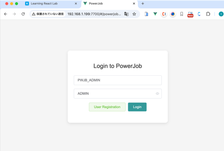
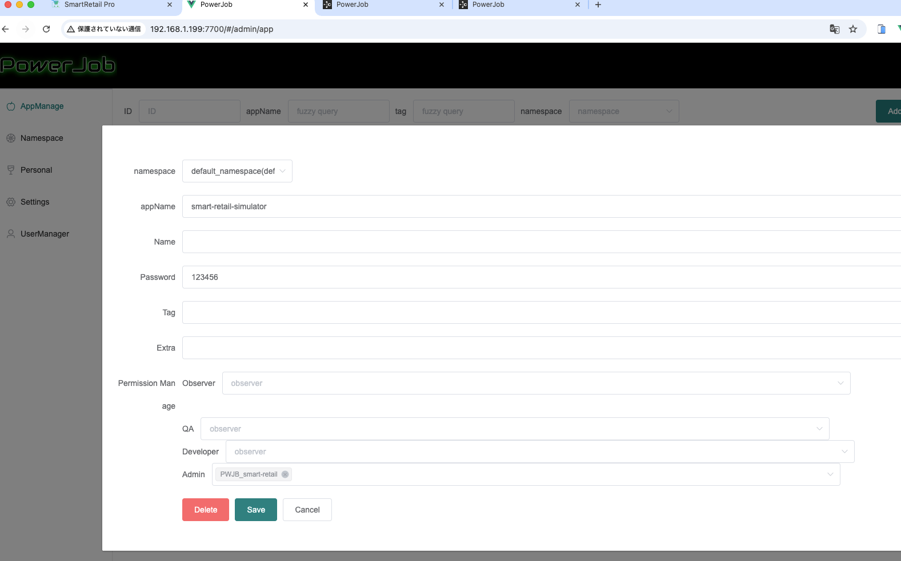
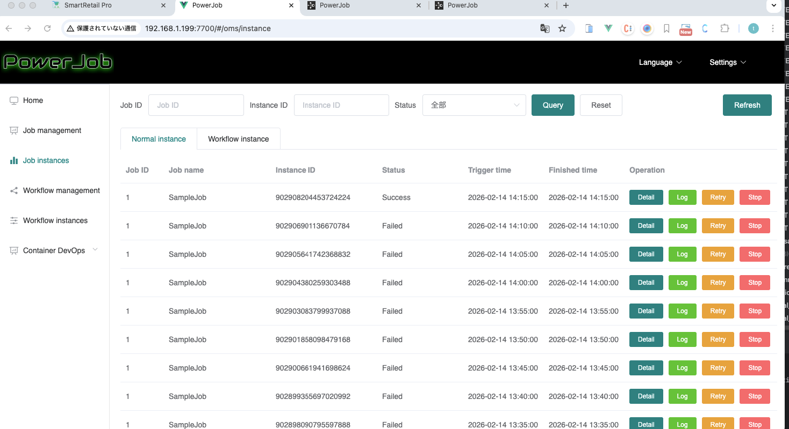

## powerjob

### concept

#### PowerJobとは（何を解決するか）
- 分散ジョブ実行基盤（Serverがスケジューリングし、Workerが実行する）
- 「どのWorkerで」「いつ」「何を」実行するかを集中管理し、実行状況・ログ・失敗の可視化やリトライを提供する

#### 主要コンポーネントと役割
- **PowerJob Server**: スケジューラ + Worker管理 + 実行指示（discovery/dispatch/heartbeat受信）
- **Worker（Executor）**: ジョブの実行プロセス。`appName` 単位で登録され、Serverから割り当てられたタスクを処理
- **DB（MySQL等）**: ジョブ定義、実行履歴、サーバ情報、ワーカー情報などの永続化
- **Console/UI（ServerのWeb）**: ジョブ管理、実行履歴、監視（本リポジトリではServerのWebポート `7700`）
- **Transporter（HTTP/AKKA/MU）**: Server↔Worker間の実通信路（本リポジトリではHTTP `10010` が主）

#### よく出る用語（最低限）
- **AppName**: Workerグループの識別子。Server側に事前登録し、Workerが同名で参加する
- **Job**: 実行したい処理の定義（スケジュール/パラメータ/実行方式など）
- **Instance**: Jobの1回の実行（実行履歴の単位）
- **Processor**: Worker側の実装（実際に処理を行うコード）

#### 概念図（通信と責務）
```mermaid
flowchart LR
  subgraph Client[管理者/開発者]
    UI[Console / Browser]
    API[CI/CD / curl]
  end

  subgraph ServerHost[Docker Host / VM]
    S[PowerJob Server]
    DB[(MySQL)]
  end

  subgraph WorkerHost[Worker Host]
    W[Worker (smart-retail-simulator)]
  end

  UI -->|HTTP 7700| S
  API -->|HTTP 7700| S
  S <-->|Transporter HTTP 10010\n(heartbeat/dispatch)| W
  S <-->|JDBC| DB
```

ポイント:
- `7700` は **UI/API入口**。Workerが実際に叩くのは多くの場合 `10010`（HTTP transporter）
- Docker/NAT環境だと、Serverが内部IPを通知しがちなので「外部から到達可能なアドレス」を別途設定する必要がある（本ファイルの `## troubleshoot` 参照）

#### 他フレームワーク/手段との比較（中級向けの観点）

| 方式 | 得意 | 苦手/注意 | PowerJobのメリット（相対） |
|---|---|---|---|
| Spring `@Scheduled` | 単一アプリ内の定期処理 | 分散/冗長化/実行管理が弱い（多重実行や可視化が課題） | 実行管理・可視化・Worker分散が最初からある |
| Quartz（組込み） | アプリ内で柔軟なスケジュール | クラスタ運用は構成が重くなりがち | Server/Worker分離で横展開しやすい |
| XXL-Job | 分散ジョブ管理（管理画面あり） | ネットワーク/実行方式の柔軟性は構成依存 | Worker discovery や dispatch/heartbeat を前提にした設計で運用しやすい |
| Airflow | DAGワークフロー/データパイプライン | インフラ・運用が相対的に重い | 「ジョブ実行基盤」としては比較的軽量に始めやすい |
| Kubernetes CronJob | クラスタでの定期実行 | 実行履歴/パラメータ/実行制御は別途実装になりがち | ジョブ定義・実行履歴・実行制御（リトライ/可視化）の枠組みが揃う |

※どれが良いかは「DAG/データ処理中心か」「アプリ内の簡易バッチか」「分散実行＋管理が必要か」で決まる。

### 設定









### 外部クライアントからの接続タイムアウト問題（2026-02-14）

#### 症状
- クライアント（smart-retail-simulator）がPowerJobサーバーへの接続でタイムアウト
- 典型ログ: `ConnectTimeoutException: connection timed out after 3000 ms: /172.18.0.9:10010`

#### 原因
- PowerJobサーバーがWorkerへ「接続先アドレス」を下ろす際、Docker内部IP（例: `172.18.0.9:10010`）を通知していた
- `OMS_SERVER_EXTERNAL_ADDRESS` のような任意の環境変数名ではなく、PowerJobが参照する **JVMシステムプロパティ** を設定する必要があった
  - `powerjob.network.external.address`（外部IP / NAT後の到達可能IP）
  - `powerjob.network.external.port`（外部ポート）
  - 必要なら `powerjob.network.external.port.http` のようにプロトコル別も設定可能

#### 解決
`apps/backend/docker/docker-compose-env.yml` の `powerjob-server` に以下を追加（例）:

```yaml
environment:
  TZ: Asia/Tokyo
  JVMOPTIONS: -Xmx512m -Dpowerjob.network.external.address=192.168.1.199 -Dpowerjob.network.external.port=10010
```

補足: `.env` には参照用に `POWERJOB_PUBLIC_ADDRESS=192.168.1.199:10010` を置いておくと再利用しやすい。

#### 反映・確認
環境変数（JVMOPTIONS）変更は「コンテナの再作成」が必要。

```bash
cd /home/noah/src/smart-retail2/apps/backend/docker
docker compose -f docker-compose-env.yml up -d --force-recreate powerjob-server

docker logs youlai-powerjob-server 2>&1 | grep -E "exist externalAddress|ALL_PROTOCOLS"
```

確認ポイント:
- `[HTTP] exist externalAddress: 192.168.1.199:10010` が出る
- `ALL_PROTOCOLS` の `externalAddress` が外部IPになっている

#### 結果
- Workerが `172.18.x.x` ではなく `192.168.1.199:10010` に接続するようになり、タイムアウトが解消

## PowerJobの設計・運用メモ

### 1) 通信の全体像（どのポートが何に使われるか）
- `7700`（Web/UI・API）: ブラウザ操作、`/server/assert` や `/server/acquire` などのサービスディスカバリ入口
- `10010`（HTTP transporter）: Worker ↔ Server の実処理通信（heartbeat / dispatch など）
- `10086`（AKKA transporter）: AKKAプロトコル用
- （環境によって）`10077`（MU transporter）: MUプロトコル用

実運用でハマりやすいのは「7700に到達できる」だけでは不十分で、選択したプロトコルの transporter ポート（例: HTTPなら10010）も到達できる必要がある点。

### 2) Docker/NAT環境で内部IPが返る理由
PowerJobサーバーは、Server側RemoteEngineがバインドしているアドレス（Docker内のIP）を基準に動く。外部ネットワーク（ホスト側・別PC）から見るとそのIPは到達不能なため、Workerが内部IPへ向かってタイムアウトする。

対策として、PowerJobが参照する `powerjob.network.external.*`（JVMシステムプロパティ）を与え、Workerへ通知するアドレスを「外部から到達可能なIP:Port」に固定する。

### 3) Composeでの最小設定パターン
ポイントは「ポート公開（ports）」と「external address の宣言（JVMOPTIONS）」の両方。

```yaml
powerjob-server:
  ports:
    - 7700:7700
    - 10010:10010
  environment:
    JVMOPTIONS: -Xmx512m -Dpowerjob.network.external.address=192.168.1.199 -Dpowerjob.network.external.port=10010
```

### 4) 切り分けチェックリスト（現場で速い順）
1. Workerログが参照している宛先が内部IPか確認（`172.18.x.x` ならほぼ設定不足）
2. Serverログで `exist externalAddress` を確認（出ないならJVMプロパティが入っていない）
3. `docker inspect` で `JVMOPTIONS` がコンテナに入っているか確認（restartだけだと反映しない場合がある）
4. クライアントPCから `192.168.1.199:10010` に疎通できるか確認（FW/SG/NAT含む）

### 5) 反映の罠（restartでは直らない）
Dockerの `restart` は「同じコンテナを再起動」するだけで、Composeのenvironment変更が適用されないことがある。環境変数の変更を確実に反映するには `docker compose up -d`（必要なら `--force-recreate`）で再作成する。
>>>>>>> 4ae2473 (power job環境)
