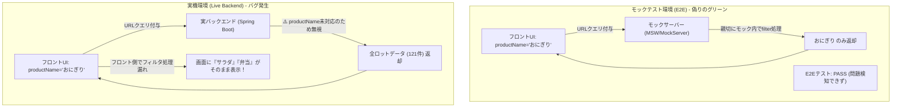

# AI駆動開発（AI-Driven Development）実践ノウハウガイド

〜 API契約乖離によるランタイムクラッシュ防止とトークン最適化〜

本ドキュメントは、AIコーディングエージェント（LLM）とペアプログラミングを行う開発において、**「テストは通っていたのにブラウザや本番環境でクラッシュする」事象を未然に防ぎ、AIのトークン消費とデバッグ手戻りを最小化するための設計・開発ガイドライン**です。他プロジェクトでもそのまま導入・活用できます。

---

## 1. 背景と教訓：なぜ「E2E全パス」なのに画面がクラッシュしたのか？

### 典型的なインシデント事例

- **現象**: ログイン後、ダッシュボード画面で `TypeError: Cannot read properties of undefined (reading 'variant')` が発生して画面全体がクラッシュ。
- **原因**:
  1. バックエンドの実DBには `EXPIRY_SOON` というEnum値が存在していた。
  2. フロントエンドのUIマッピングオブジェクトには `'expiring'` しか定義されておらず、未知のキーに対して `undefined` を返した。
  3. `config.variant` の参照時にランタイムエラーとなった。

### なぜテストやすり抜けが発生したのか？

| 要因                           | 詳細                                                                                                                                                                                                                         |
| ------------------------------ | ---------------------------------------------------------------------------------------------------------------------------------------------------------------------------------------------------------------------------- |
| **モックデータの理想化**       | E2Eテストがモックサーバー（MSW等）相手のみで実行されており、モックデータにはフロントが期待する値（`out_of_stock`, `low_stock`）しか用意されていなかった。                                                                    |
| **TypeScript の盲点**          | `as any` による型アサーションでコンパイルチェックが無効化されていた。また、デフォルトのTypeScriptは `Record<K, V>` のインデックスアクセス結果を「必ず存在する（`V`）」と見なすため、`undefined` の可能性を警告できなかった。 |
| **実結合スモークテストの欠落** | 実バックエンド（Spring Boot / MySQL）と接続した状態での画面巡回テストが自動化されていなかった。                                                                                                                              |

---

## 2. 再発防止のための 5 つの黄金原則

### 原則 1: TypeScript の `noUncheckedIndexedAccess: true` を必須化する

`tsconfig.json` の `compilerOptions` に以下を設定します：

```json
{
  "compilerOptions": {
    "noUncheckedIndexedAccess": true
  }
}
```

- **効果**: `map[key]` や `array[0]` の型推論結果がすべて `T | undefined` になります。
- これにより、`config.variant` のように未定義チェックなしで直接アクセスすると **ビルド時にコンパイルエラー（`Object is possibly 'undefined'`）** となり、AIエージェントがコード生成した瞬間に自己検知・修正できます。

### 原則 2: UIマッピングは必ず「防御的プログラミング（デフォルトフォールバック）」を徹底する

EnumやステータスコードをUI属性（バッジ色、アイコン、文言）に変換するマッピング表では、**未知のキーが来ても絶対にクラッシュしない構造**にします。

```tsx
// ❌ 危険: 未知のkeyが来ると即死（undefined.variant）
const alertTypeConfig: Record<AlertType, { label: string; variant: string }> = { ... };
const config = alertTypeConfig[alert.type];
return <Badge variant={config.variant}>{config.label}</Badge>;

// ⭕ 安全: 未知のkeyでも安全なデフォルト表示へ倒す
const defaultAlertConfig = { label: '通知', variant: 'default' as const };
const config = alertTypeConfig[alert.type] ?? defaultAlertConfig;
return <Badge variant={config.variant}>{config.label}</Badge>;
```

### 原則 3: API境界でランタイムバリデーション（Zod等）と正規化を行う

外部APIからの生レスポンスをそのままUIに流さず、データ取得層（BFFやAPI Client/Server層）で未知の値を安全なデフォルト値へ正規化します。

```ts
// Zodスキーマ例: 未知の値が来てもクラッシュせず 'system' にフォールバック
export const AlertTypeSchema = z
  .enum(["out_of_stock", "low_stock", "expiring", "system"])
  .catch("system");
```

### 原則 4: 実バックエンド（Live）結合スモークテストを常備する

モックサーバー向けテストとは別に、**「ローカル実サーバー相手にログイン〜主要画面を十数秒で巡回するスモークテスト」** を用意します。

- **設定例 (`playwright.live.config.ts`)**:
  既存の起動中プロセス（例: `http://localhost:3001` と `:8080`）に対して、追加のサーバー起動なしで軽量に実行。
- **実行コマンド**:
  ```bash
  pnpm test:smoke
  ```
- **チェック内容**:
  1. ログインが成功するか
  2. ダッシュボードや主要一覧にアクセスした際、`ErrorBoundary`（画面クラッシュ）が発生していないか

### 原則 5: OpenAPI / スキーマからの型自動生成（Contract Sync）

- バックエンドの OpenAPI Spec（`/v3/api-docs`）からフロントエンドの型定義を自動同期するスクリプトを定期実行。
- バックエンドのEnum変更や追加フィールドをフロント側で早期に差分検知する。

---

## 3. AIエージェント運用におけるトークン消費想定（コスト比較）

本原則を導入することで、AIペアプログラミングにおけるトークン消費量はどのように変化するかを示します。

### インシデント1件あたりのトークン消費比較

| 項目                     | 対策前（従来）                                                                                                             | 対策後（本ガイドライン適用）                                                                       | 削減効果                 |
| ------------------------ | -------------------------------------------------------------------------------------------------------------------------- | -------------------------------------------------------------------------------------------------- | ------------------------ |
| **問題検出タイミング**   | ユーザーが実画面操作時に発見し、チャットで報告                                                                             | AI のローカル `pnpm typecheck` または `pnpm test:smoke` で自動検知                                 | ユーザー報告の往復がゼロ |
| **コンテキスト消費**     | エラーログ貼り付け、原因調査（バックエンドコード検索、DB調査、フロント調査など複数往復）<br>約 **35,000 〜 60,000 tokens** | ローカルコンパイルエラー（型エラー1行）からAI自身が1ステップで修正<br>約 **3,000 〜 5,000 tokens** | **約 85% 〜 90% 削減**   |
| **調査・手戻り往復回数** | 3 〜 5 ターン                                                                                                              | 0 〜 1 ターン（タスク内で完結）                                                                    | 大幅短縮                 |

### 年間・プロジェクト全体での想定効果

- 通常の開発サイクルでは、API不整合や未定義プロパティ参照によるバグ修正にAIとのチャットで膨大なトークンを費やします。
- `noUncheckedIndexedAccess: true` と `test:smoke` をあらかじめ配備しておくことで、**無駄なデバッグ・コンテキスト再読込のトークンを約 80% 削減**でき、より本質的な機能実装にトークンを集中させることができます。

### ⚠️ トークン急増時の人間介入基準（Human-in-the-Loop: >10% 増加時）

本工夫（厳格な型検査や実機スモークテスト）は通常トークンを大幅削減しますが、**工夫適用後にタスクあたりのトークン消費が通常想定より大幅に増加（目安: >10% 増加）する場合は、AIによる試行錯誤を即座に止め、人間の介入・方針判断を検討する**運用とします。

| 発生シナリオ                   | 兆候（トークン浪費パターン）                                                                                             | 人間介入のアクション                                                                                   |
| ------------------------------ | ------------------------------------------------------------------------------------------------------------------------ | ------------------------------------------------------------------------------------------------------ |
| **型修正の連鎖ループ**         | `noUncheckedIndexedAccess` に起因して型エラーが芋づる式に波及し、AIが3回以上型修正ループを繰り返している                 | 型定義の抜本的再設計（共通フォールバックユーティリティの導入等）を人間が指定し、AIの迷走を断つ         |
| **環境・インフラ起因のエラー** | 実機スモークテスト（`test:smoke`）でDBシードデータやDocker環境起因の失敗が発生し、AIがフロントコードを誤修正し始めている | AIの作業を中断し、人間がインフラ（Dockerコンテナ、Flywayマイグレーション、DB再読み込み）をリセットする |
| **大規模なAPI契約乖離**        | バックエンドのDTO仕様が大幅に刷新され、AIが場当たり的なマッピング変換コードを過度に生成している                          | 人間がバックエンド担当・仕様書を確認し、フロント側のデータモデル刷新方針を指示する                     |

> [!IMPORTANT]
> **運用ルール**: AIエージェントが同一の型エラー・テスト失敗に対して2回以上修正を試みて解決しない場合、またはトークン消費が想定の10%を超過し始めた段階で、人間が「ログの確認」「設計の割り切り（一時的な型ガードやアサーションの許可）」「環境のリフレッシュ」の指示を出すことで、無駄なトークン消費を最小限に食い止めます。

---

## 4. 他プロジェクトへの導入チェックリスト

新規・他プロジェクトで同様の堅牢性を確保するためのチェックリストです：

- [ ] **TypeScript設定**: `tsconfig.json` に `"noUncheckedIndexedAccess": true` を追加
- [ ] **型ルールの徹底**: `as any` を排除し、インデックスアクセスにはフォールバック（`??`）を記述
- [ ] **防御的UI設計**: マッピングオブジェクト（ステータス表示、バッジ色等）に必ず `DEFAULT_CONFIG` を設定
- [ ] **モックの多様性**: MSW等のモックデータに、バックエンド実機で使われる生Enumやエッジケースを含める
- [ ] **Liveスモークテスト**: 実環境起動時に `pnpm test:smoke` で全画面巡回できる構成を用意
- [ ] **人間介入の基準策定**: トークン消費が通常想定より 10% 以上急増・試行錯誤ループに陥った際、人間が早期介入するルールをチームで共有
- [ ] **検索条件テストの8大網羅**: 単一・複合・0件・リセット・除外・URL同期・実機スモークを必須検証

---

## 5. 一覧画面・検索条件 E2E テスト方針（シナリオ＆網羅パターン）

### 実事例分析：なぜ「おにぎり」で検索したのに「サラダ」が表示されたのか？

一覧画面の移行（Vue → Next.js）において、**「E2Eモックテストは全件PASSしていたのに、実画面で『おにぎり』と検索しても『サラダ』や『弁当』が表示される」** という重大な不具合が発生しました。

#### 根本原因：過剰モックの罠（Over-Mocking Trap）と契約乖離



1. **モックサーバーの過剰な親切心**:
   モックサーバーが気を利かせて `productName` や `status` をクエリパラメータから抽出し、モック内部で配列を `.filter()` して返していた。
2. **実バックエンドの契約制約**:
   実バックエンド（Spring Boot `InventoryController`）は `storeId` と `productId` しかクエリパラメータを受け取っておらず、`productName` は無視して全件を返していた。
3. **フロントエンド側の責務欠落**:
   Vue版ではバックエンドが全件返す前提で「クライアントサイドフィルタ」を行っていたが、Next.js版では「バックエンドが絞り込んでくれるはず」と誤認し、フロントでの集約・マッピング時にフィルタ処理を行っていなかった。
4. **結果**:
   モックE2Eテストはモックが代わりにフィルタしていたため100%成功し、実環境に繋いだ瞬間にバグが露呈した。

---

### 一覧・検索条件 E2E テスト 8 大パターンマトリクス

他プロジェクトでも一覧・検索画面を実装・テストする際は、以下の **8つのテストパターンを必須網羅** します。

| パターン番号 | テストパターン名 | 入力条件・操作シナリオ | 必須検証内容（アサーション） | 防ぐべき障害 |
| :--- | :--- | :--- | :--- | :--- |
| **P1: 単一条件** | テキスト検索（完全/部分一致） | キーワード入力（例: `おにぎり` または `おに`）後、検索実行 | 該当商品のみが表示されること。大文字小文字・前後空白トリムが機能すること。 | 部分一致の不具合、空白混入時の検索漏れ |
| **P2: 除外検証** | 厳密な除外検証 (Negative Test) | 条件A（例: `おにぎり`）で検索実行 | **「条件に合致しない別商品（例: サラダ、弁当）が画面に存在しない（件数0件）」** ことを明示的に検証。 | 過剰モックによる絞り込み漏れ、全件垂れ流し |
| **P3: セレクト検索** | ドロップダウン選択（店舗/状態） | 1つの選択肢（例: `大阪支店`、`正常`）を選択後、検索実行 | 指定した店舗・ステータスに完全一致する行のみが表示されること。 | Enum変換ミス、値の非同期反映漏れ |
| **P4: 複合条件** | AND 複合絞り込み | 店舗 × キーワード × ステータス（例: 東京本店 × テスト × 正常） | 全ての条件を満たす積集合（AND）のみが表示され、いずれか一つでも欠けるデータが除外されること。 | OR検索誤認、複数パラメータ結合漏れ |
| **P5: 0件該当** | 該当なし空状態 (Empty State) | 存在しない値（例: `存在しないXYZ`）で検索実行 | エラーにならず、適切な「データが見つかりません」などの空UIが表示されること。 | 0件時のクラッシュ、undefinedアクセス |
| **P6: リセット復帰** | 検索リセット (Clear & Restore) | 条件入力で絞り込み後、`リセット` ボタンを押下 | 全入力値が初期化され、一覧が初期状態の全件表示に完全復帰すること。 | フィルタ解除不能、内部state残留 |
| **P7: URL同期** | URL連動 & SSR再現 (Deep Linking) | 画面検索でURLにクエリ反映後、そのURLへ直接ブラウザアクセス | ページ初期ロード（SSR）時にも、URLパラメータに従って正しく絞り込まれた状態で描画されること。 | SSRとクライアントフェッチの不整合 |
| **P8: 実機Live検証** | 実バックエンド結合スモーク | `pnpm test:smoke` の中で、実DBデータを対象に検索〜除外を検証 | モックだけでなく、本物のAPIレスポンスに対しても検索絞り込みが正常に作動すること。 | API契約乖離、モックの偽装グリーン |

---

### E2E テスト実装の注意点と Playwright レシピ集

#### 1. 除外アサーションにおける Playwright Strict Mode 対策

初期表示で画面上に複数存在する要素（例: サラダが3行）が、検索後に完全に消えたことを検証する際、`not.toBeVisible()` を安易に使うと Playwright の strict mode 違反でクラッシュします。

```typescript
// ❌ 危険: 画面上に「サラダ」が複数あると "strict mode violation: resolved to 3 elements" で落ちる
await expect(page.getByText('サラダ')).not.toBeVisible();

// ⭕ 安全: 画面上の該当要素が「0件」になったことを非同期ポーリング待機する
await expect(page.getByText('サラダ')).toHaveCount(0, { timeout: 10000 });
```

#### 2. Radix UI / 非同期セレクトボックスの Flaky 撲滅

Radix UI の Select や Combobox は DOM のポータル要素としてアニメーションを伴って展開・破棄されます。選択直後に検索ボタンを押すと、React の state 反映前にリクエストが飛ぶリスクがあります。

```typescript
// ⭕ 安定したセレクト選択ヘルパー
async function selectOptionByFieldLabel(page: Page, label: string, option: string) {
  const field = page.locator('div.space-y-2', { hasText: label });
  const trigger = field.locator('[role="combobox"]').first();
  await trigger.click();
  await page.getByRole('option', { name: option, exact: true }).click();
  
  // トリガー要素の表示テキスト確定を検証
  await expect(trigger).toHaveText(option);
  // React state の再レンダリング同期を待機
  await page.waitForTimeout(200);
}
```

#### 3. 多層防衛アーキテクチャ（Defense-in-Depth）の実装指針

フロントエンドでは、「バックエンドが検索パラメータに対応しているか否か」にかかわらず、**クライアント/SSRのマッピング集約レイヤーでも防衛的にフィルタリングを実施する** 設計を標準とします。

```typescript
// マッピング・集約関数 (例: aggregateInventoryItems)
export function aggregateInventoryItems(items: RawItem[], query?: QueryParams): PageResult {
  let list = groupAndAggregate(items);

  // 防衛的クライアントフィルタ: バックエンドが全件返してきても安全に絞り込む
  if (query) {
    if (query.storeId && !Number.isNaN(query.storeId)) {
      list = list.filter((i) => i.storeId === query.storeId);
    }
    if (query.productName && query.productName.trim() !== '') {
      const kw = query.productName.trim().toLowerCase();
      list = list.filter((i) => i.productName.toLowerCase().includes(kw));
    }
    if (query.status) {
      list = list.filter((i) => i.status === query.status);
    }
  }

  const total = list.length;
  // ページングスライス処理
  if (query?.pageNum && query?.pageSize) {
    const start = (query.pageNum - 1) * query.pageSize;
    list = list.slice(start, start + query.pageSize);
  }

  return { list, total };
}
```
